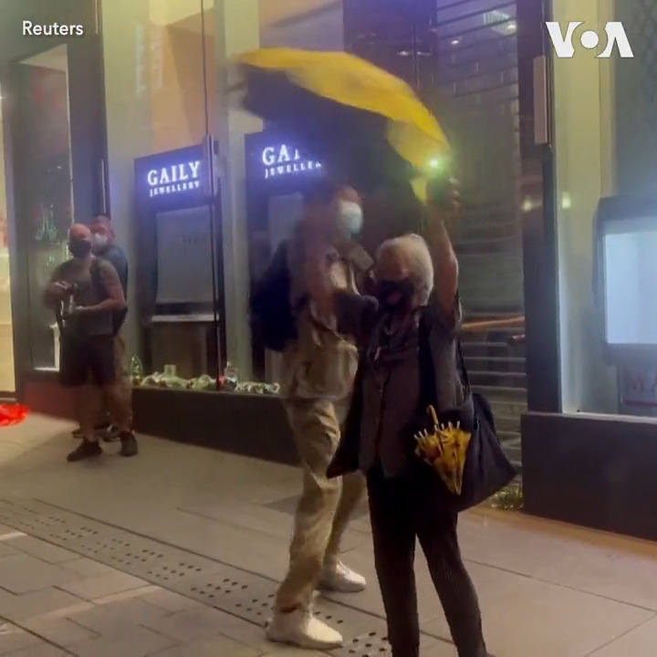

美国之音中文网 北京时间 2022-11-29T03:15:12Z 1597308142601502720 香港广为人知的民主活动人士王婆婆28日在中环和其他抗议者一道对上海、北京和其他城市的抗议民众表达支持，她高喊不要威权，要人权的口号；一名男子暴力抢夺她的黄色雨伞，扔到地上，导致王婆婆摔倒在地。视频中可以看到这名男子后来被警方带走，王婆婆被送上救护车。 
https://t.co/q2K5oCJHtc https://t.co/EK6UUfVk32   