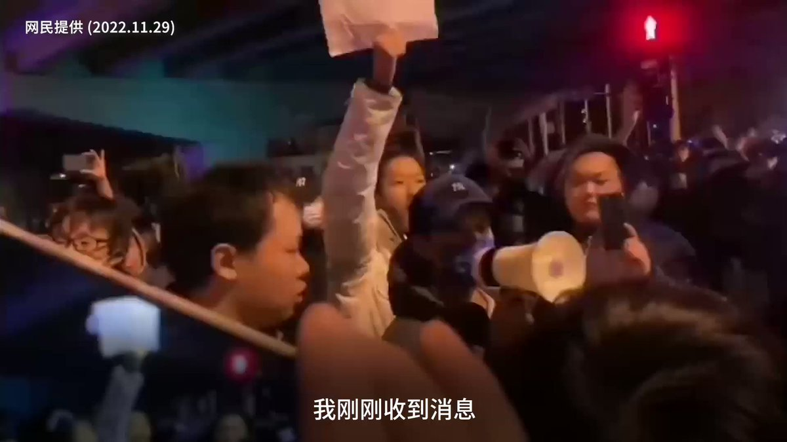

自由亚洲电台 北京时间 2022-11-29T13:31:29Z 1597463235346976768 【“#境外势力”煽动抗议？】
【北京人怒怼】
中国各地掀起“#白纸运动”，中国媒体归咎于“境外势力”，一名男子在北京一场聚集就称有“境外反华势力”，遭抗议者怒怼。他们说:“请问 #新疆 的火是境外势力放的吗?请问 #贵州 的大巴是境外势力推翻的吗? 我们连网都上不到国外的，我们哪儿来的境外势力?” https://t.co/XEaPZOfGkO   