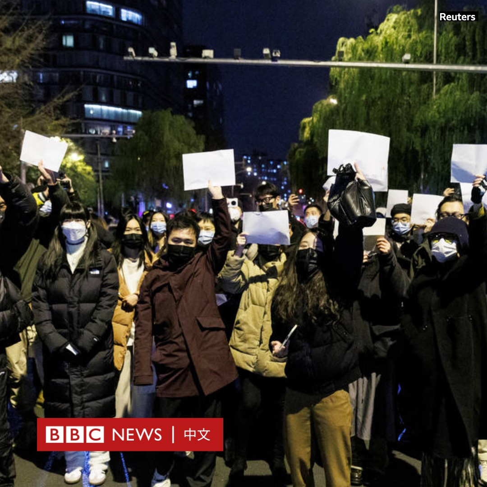
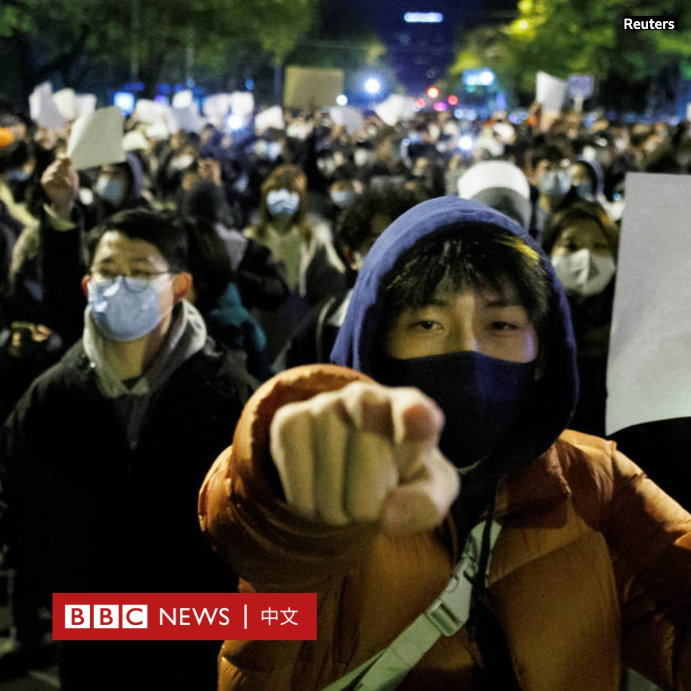
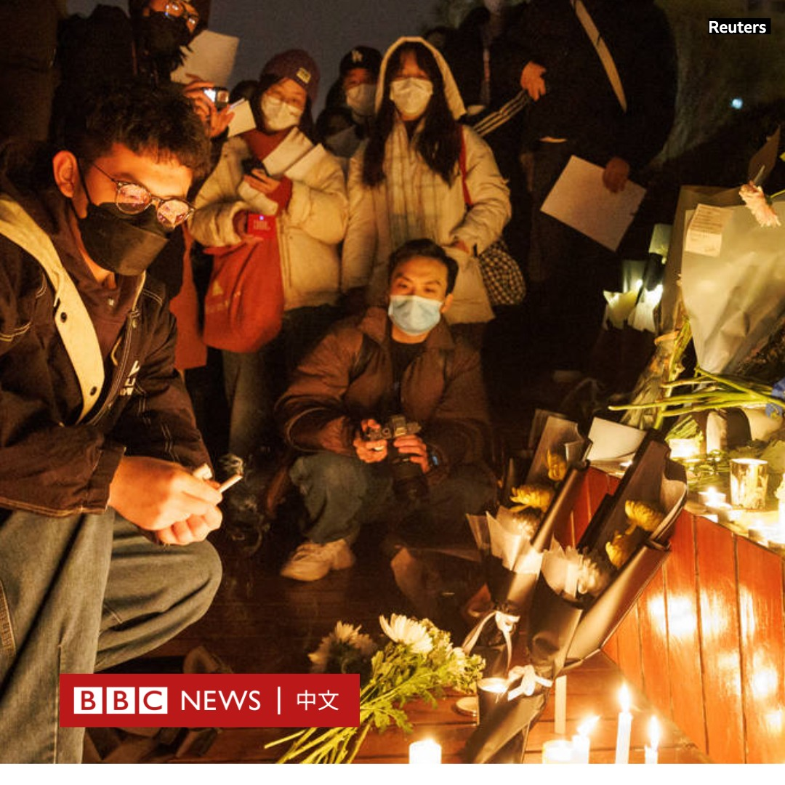
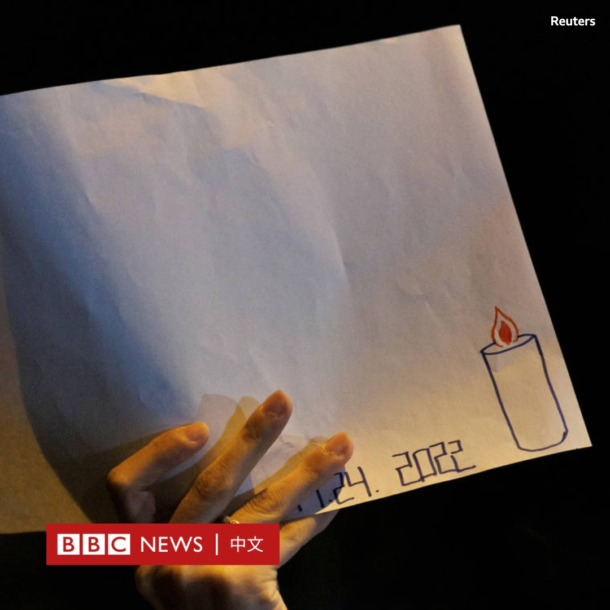
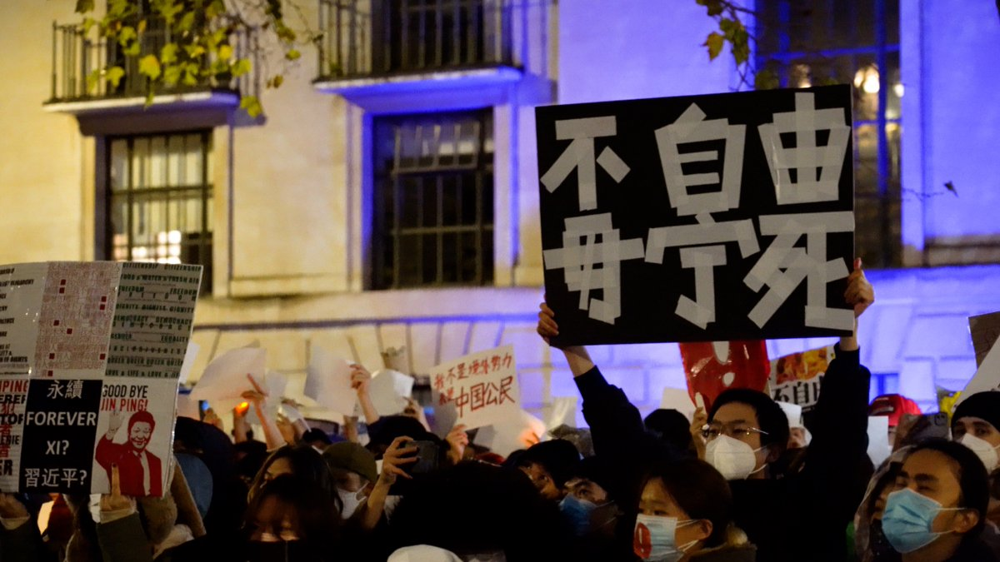
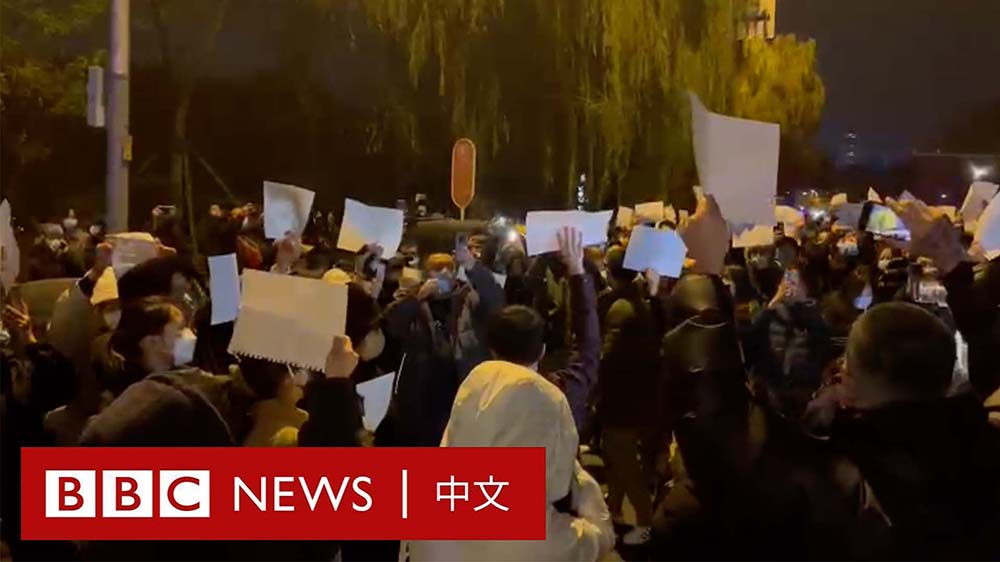

D英国广播公司BBC 北京时间 2022-11-28T23:00:03Z 1597243932056096769 一件东西常常可以成为一场抗议运动的象征。这次在中国，那是一张不起眼的白纸。一名北京示威者说，白纸“代表了我们想说但不能说的一切”。https://t.co/qZgBsdqsxT   D英国广播公司BBC 北京时间 2022-11-28T22:15:01Z 1597232598358659076 BBC记者劳伦斯（Ed Lawrence）在报道上海乌鲁木齐中路的抗议活动时被警方拘押殴打。中国外交部发言人说：他没有主动出示记者证。https://t.co/AUwlhKJVx2   D英国广播公司BBC 北京时间 2022-11-28T10:40:20Z 1597057775393116161 中国上海11月26至27日有群众到乌鲁木齐路聚集，悼念24日新疆乌鲁木齐大火死难者之后，首都北京27日晚也有群众上街抗议，并持续至28日清晨。

人们高呼口号，谴责中国严格的防疫政策并呼吁自由。北京的抗议群众举起白纸和和空白横幅表达不满。这些空白横幅被视为中国审查制度的象征。 https://t.co/gDeqm0oqz4   D英国广播公司BBC 北京时间 2022-11-28T15:29:09Z 1597130457753296897 2022年11月27日晚间，估计数百名示威者聚集在中国于伦敦的驻英大使馆外声援中国的反封控抗议。 https://t.co/ugTGAin5TT   D英国广播公司BBC 北京时间 2022-11-28T02:26:26Z 1596933482881552385 反对疫情封锁的抗议在中国多座城市蔓延。周日（11月27日）晚间，北京朝阳区亮马河附近有数以百计的抗议者集会。

许多民众手持白纸，高喊“不要核酸要自由”的口号。

此类抗议在北京非常罕见。当局部署了大量警力到场戒备。 https://t.co/96pnYY7xaq   