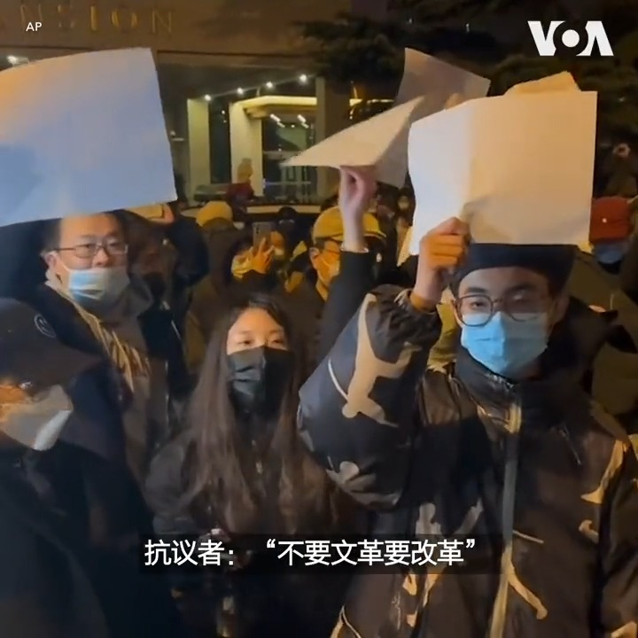
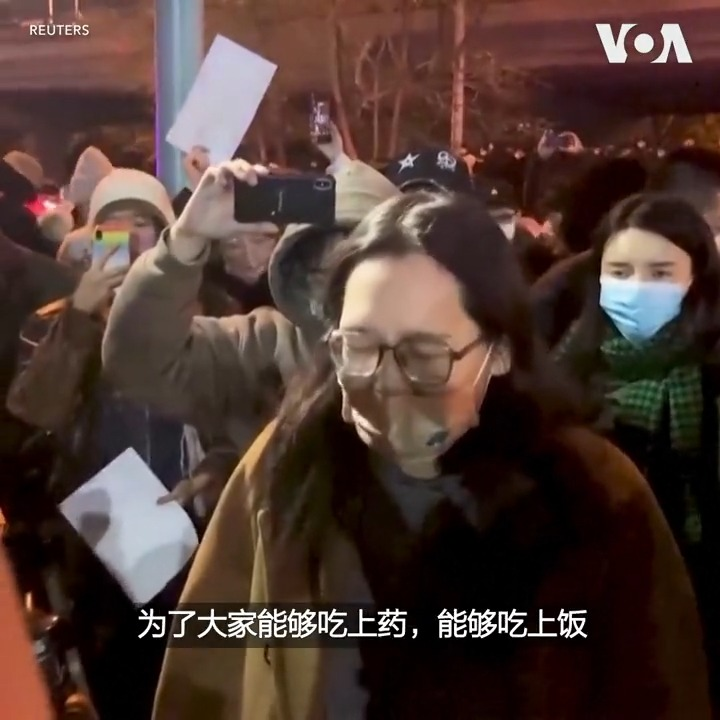

美国之音中文网 北京时间 2022-11-28T03:51:42Z 1596954938894319616 11月27日，北京市民连续第三天举行示威活动，抗议当局严格的新冠封控措施。抗议者们手举白纸，高喊“不要核酸要自由”、“不要文革要改革”等口号，表达对疫情封控的强烈不满。除北京外，上海、广州、和乌鲁木齐等至少8座中国城市都爆发了反封控抗议，这是几十年来最广泛的反政府抗议活动。 https://t.co/Vr9BRxXiwU   美国之音中文网 北京时间 2022-11-28T05:38:48Z 1596981894922452992 11月28日凌晨，北京抗议当局严厉封控措施的示威活动仍在继续。上千名抗议者聚集在北京亮马河附近，手举白纸，要求“解封北京”、“解封全国”。有抗议者表示，人们不需要“大筛查”、“大清洗”，还有抗议者要求当局释放上海的被捕示威者。 https://t.co/xoucwEN70g   