自由亚洲电台 北京时间 2022-11-28T16:52:07Z 1597151340035047424 悼念新疆乌鲁木齐火灾事件，不仅在中国各地延烧。在英国和日本的中国留学生也分别发起抗议和守夜活动响应白纸运动。在中国驻英国领事馆外“共产党下台”不断；在东京的抗议者高唱义勇进行曲，怒吼“共产党下台、习近平下台”。

#白纸运动
#中国驻英国大使馆
#中国留学生在东京 https://t.co/usujL8TFNw 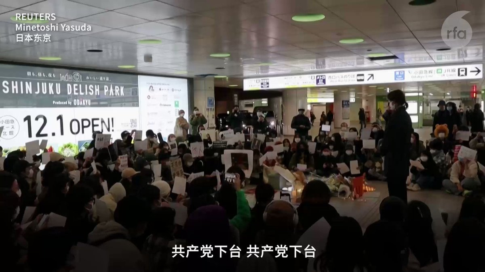  自由亚洲电台 北京时间 2022-11-28T05:27:08Z 1596978958851256320 全球呼应 接力转推自  @whyyoutouzhele 
1.英国伦敦  中国大使馆前
2.法国巴黎 蓬皮杜中心
3.荷兰阿姆斯特丹 水坝广场
4.爱尔兰都柏林 https://t.co/IsI3D2whmT 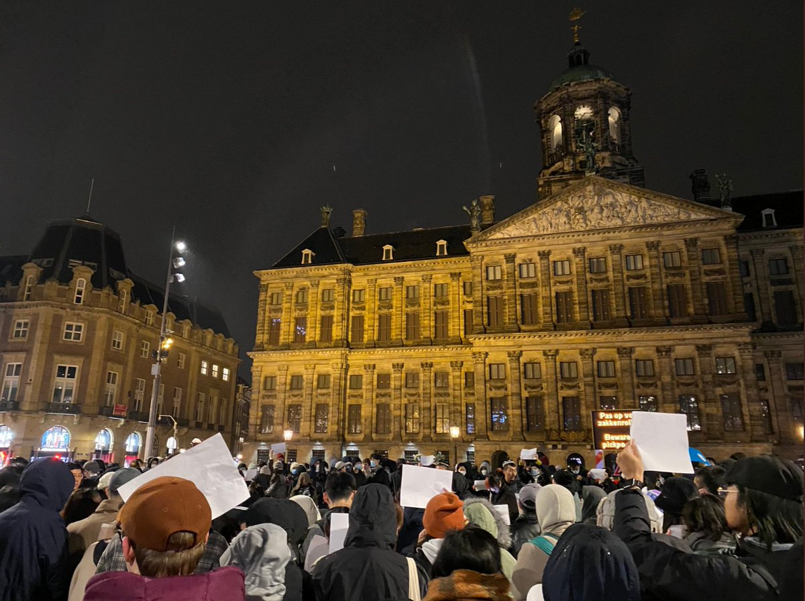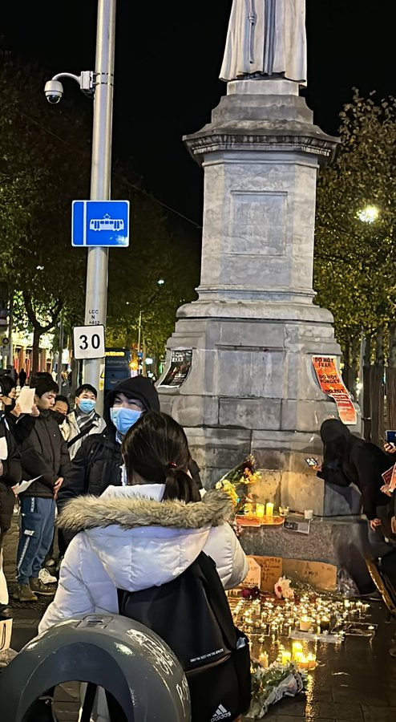  自由亚洲电台 北京时间 2022-11-28T06:37:54Z 1596996767148830721 【BBC记者已获释 中国当局说逮他是为他好】
Ed Lawrence报道上海抗议活动时被捕，关押数小时后，现已获释。期间遭到警察拳打脚踢
BBC回复本台质询时称“我们未得到中国当局的官方解释或道歉。后来释放他的官员声称，逮捕他是为了他好，以防他从人群感染新冠。”BBC表示不可信。
视频转自@TGTM_Official https://t.co/kVYIHCMwoF 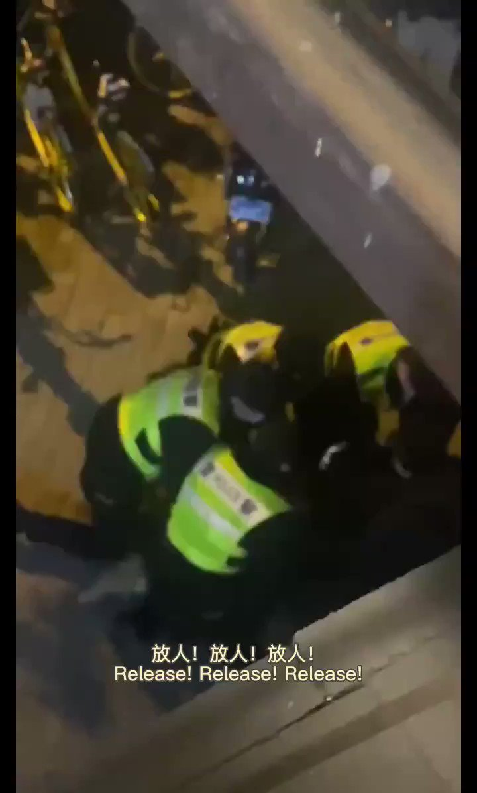  自由亚洲电台 北京时间 2022-11-28T18:36:20Z 1597177564938006536 新疆乌鲁木齐火灾事件，引爆中国白纸运动遍地开花。中国外交部发言人赵立坚宣称是 #别有用心 势力，把火灾与防疫联系。对于BBC记者在上海采访被捕。中国官员先是宣称为了防止采访被感染，赵立坚责推记者未表明身份。

#赵立坚
#白纸运动 https://t.co/Fcy86aWe8t 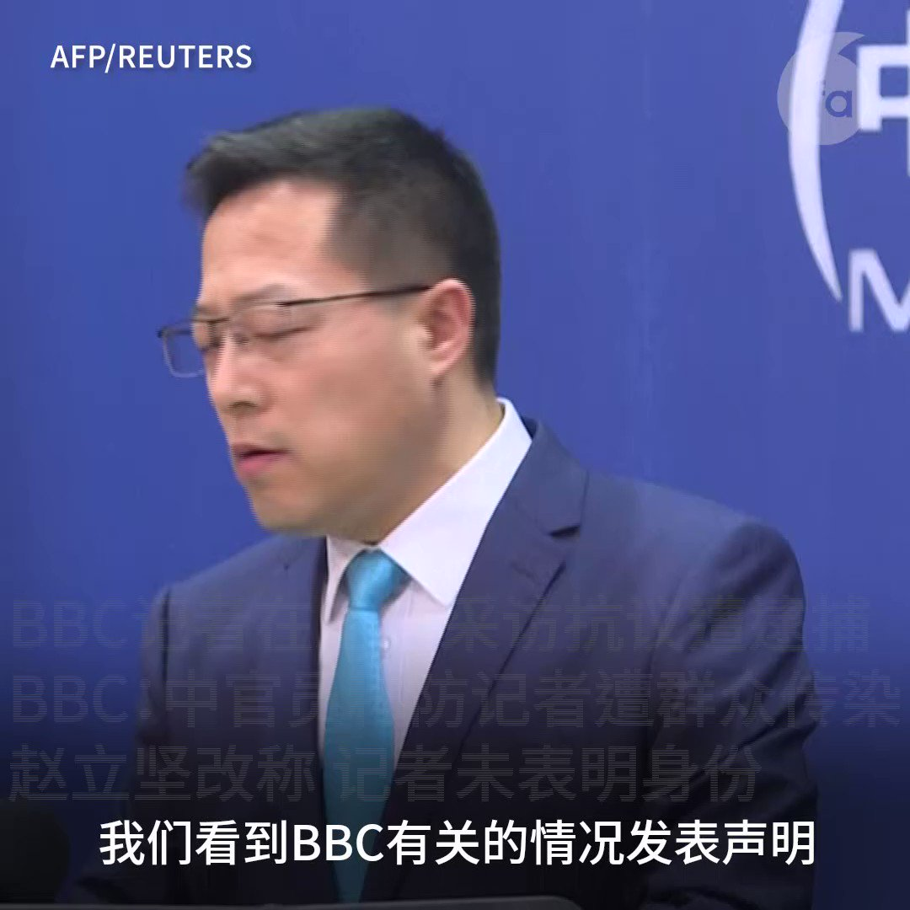  自由亚洲电台 北京时间 2022-11-28T09:11:44Z 1597035478074945536 【举世瞩目！】
中国民众抗议运动被《纽约时报》、《卫报》、《金融时报》、英国广播公司等多家全球知名媒体头版报道。 https://t.co/qCYCm6ZJT5 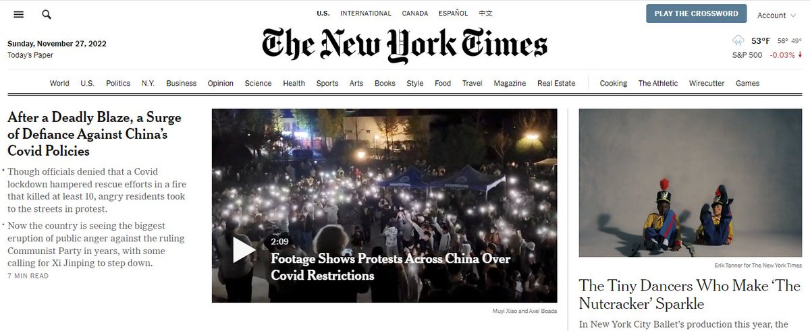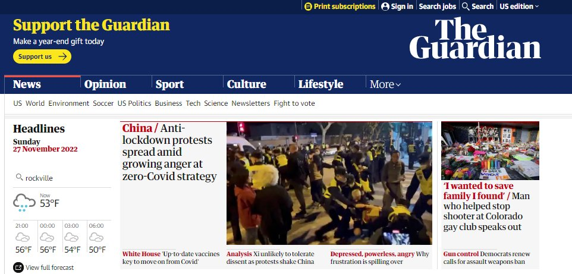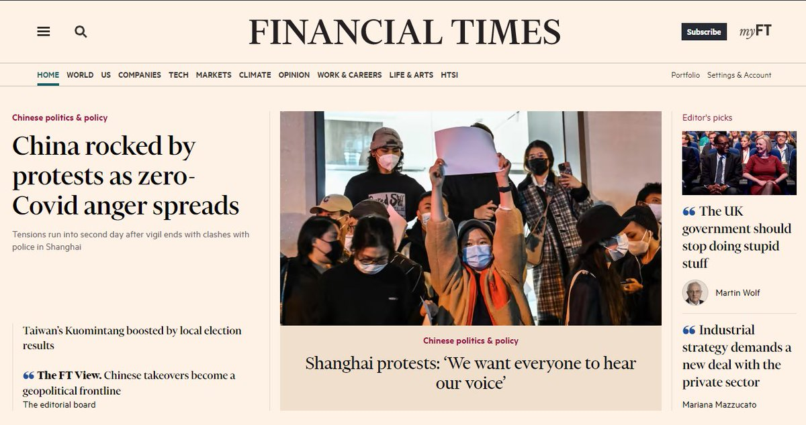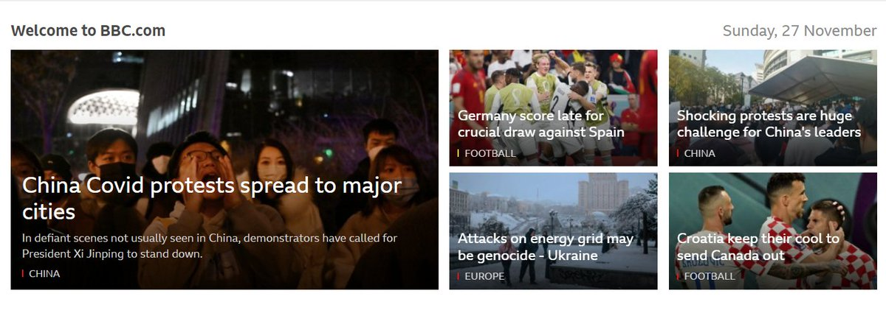  自由亚洲电台 北京时间 2022-11-28T00:17:47Z 1596901108555055106 【中国至少十大城市爆发反政府示威】
【武汉人进入不眠夜】
过去几日，中国至少十个大城市出现大型反防疫示威，不少诉求从解封上升到政治改革层面，是1989年以来罕见。
在疫情爆发地武汉市，市民一直没有停下来，各大小居民区的民众都纷纷走到街上，到晚上，民众聚集在中山大道叫口号，整夜都不肯散去 https://t.co/12a869qjJk 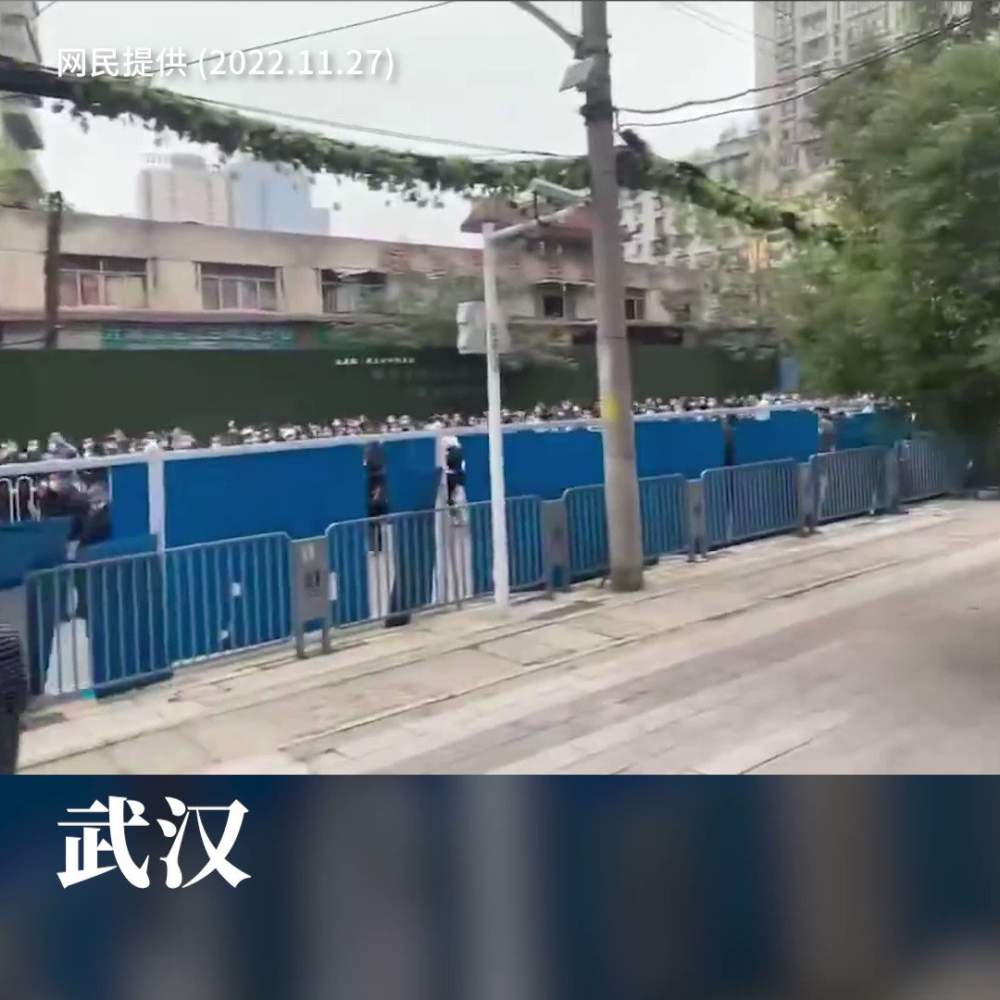  自由亚洲电台 北京时间 2022-11-28T09:37:11Z 1597041886018949120 11月27日中国抗议视频集锦 https://t.co/eftJuO5OgW 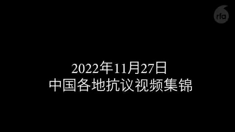  