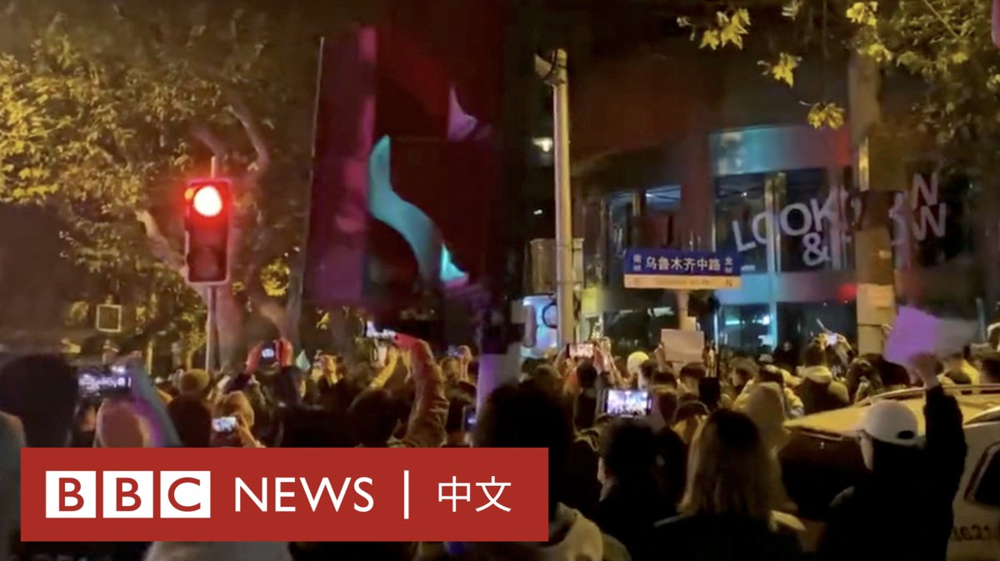

D英国广播公司BBC 北京时间 2022-11-27T18:11:58Z 1596809046752985095 11月27日凌晨，上海乌鲁木齐中路大批民众走上街头，抗议中国严苛的新冠限制措施并缅怀新疆乌鲁木齐公寓大火的死难者。

愤怒的群众手举白纸，高喊“共产党下台”“习近平下台”等口号，这是公开场合下，民众罕有表达对中共最高领导层的不满。 https://t.co/TmizJhAytH   