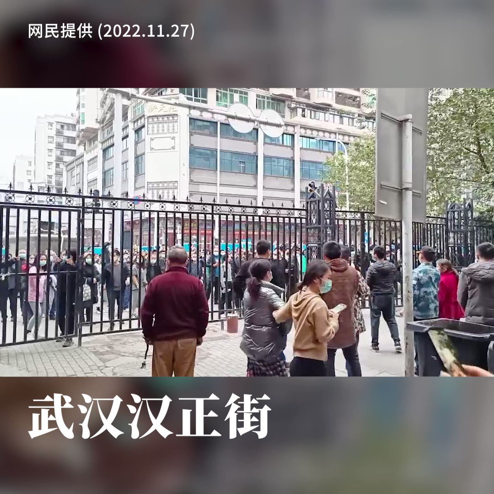
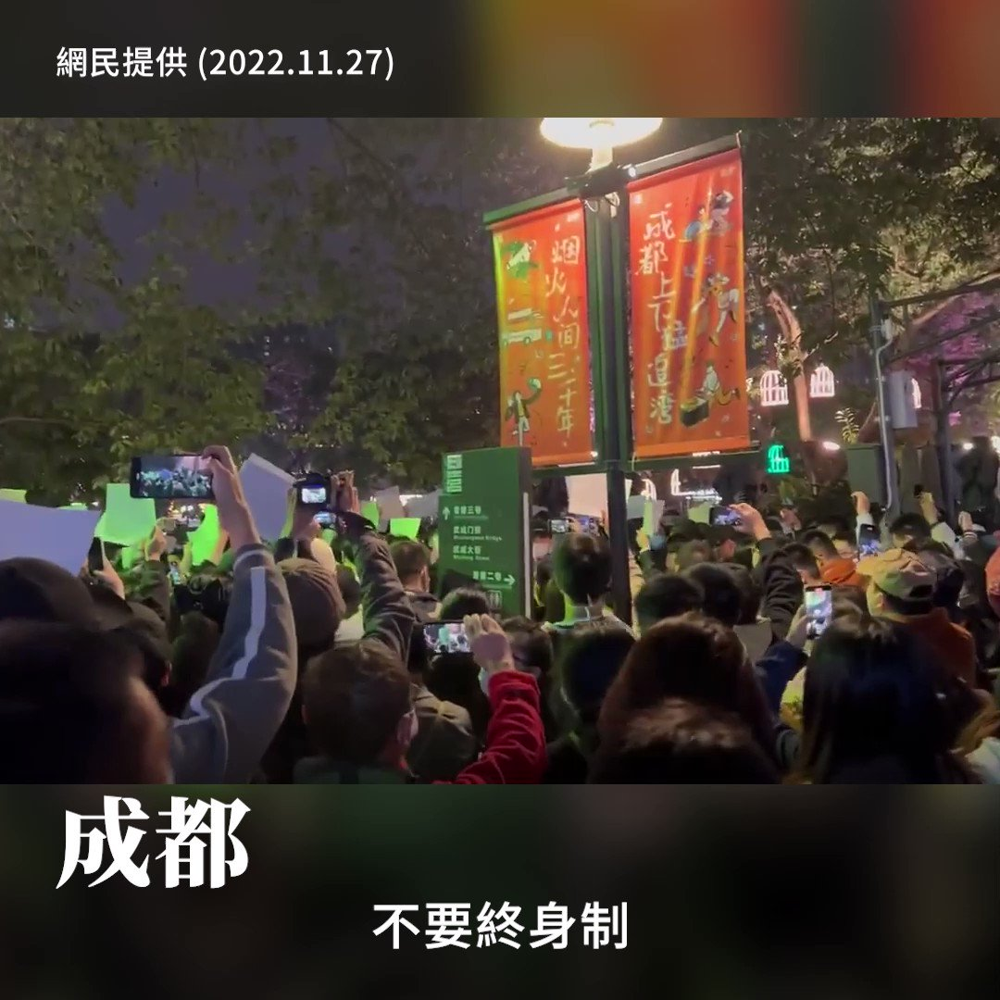

自由亚洲电台 北京时间 2022-11-27T21:04:19Z 1596852419169746944 【武汉人推牆起义】
【武汉居民 ：「疫情从武汉开始，就从武汉结束」】
中国示威浪潮遍地开花，走上街头的人数远超防疫人员，越来越多社区的防疫人员已撤走，到周六、日，民众不约而同走到街上，推翻各式各样的障碍物。
在武汉汉正街，居民合力把小区的巨型铁闸推翻，走到街上跟其他小区居民汇合。 https://t.co/1Y8awUcsuK   自由亚洲电台 北京时间 2022-11-27T22:48:41Z 1596878685445197824 【中国民情由反对封城逐步转向反政治体制】
【成都居民喊出 "不要㚵身制、不要皇帝"口号】　
继上海示威群众喊出 "习近平下台、共产党下台"口号后，四川成都居民周日晚也喊出"不要终身制、中国不需要皇帝"，及要求有"言论自由、新闻自由"口号。

#八九六四
#政治体制改革
#终身制
#乌鲁木齐
#动态清零 https://t.co/50zMuRBEbW   