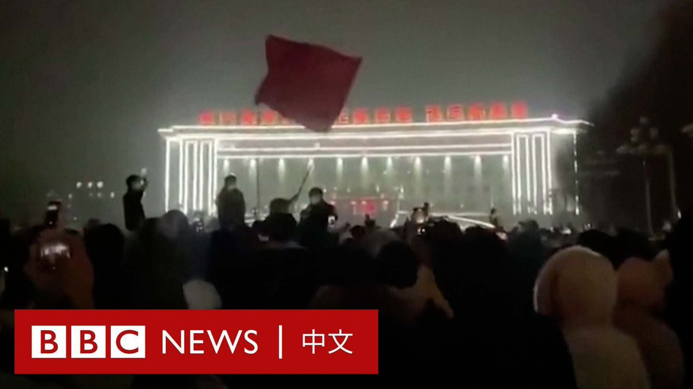

D英国广播公司BBC 北京时间 2022-11-26T15:17:04Z 1596402643492130816 中国新疆首府乌鲁木齐周五（11月25日）晚爆发抗议，要求政府结束超过三个月的新冠疫情封锁。

社交媒体上的画面显示，很多居民在马路上聚集。一些民众来到一处政府大楼前，高唱国歌。

乌鲁木齐市政府周六宣布，该市已实现“社会面基本清零”目标，将“分阶段有序恢复低风险区居民生活秩序”。 https://t.co/2C0bZUUrol   