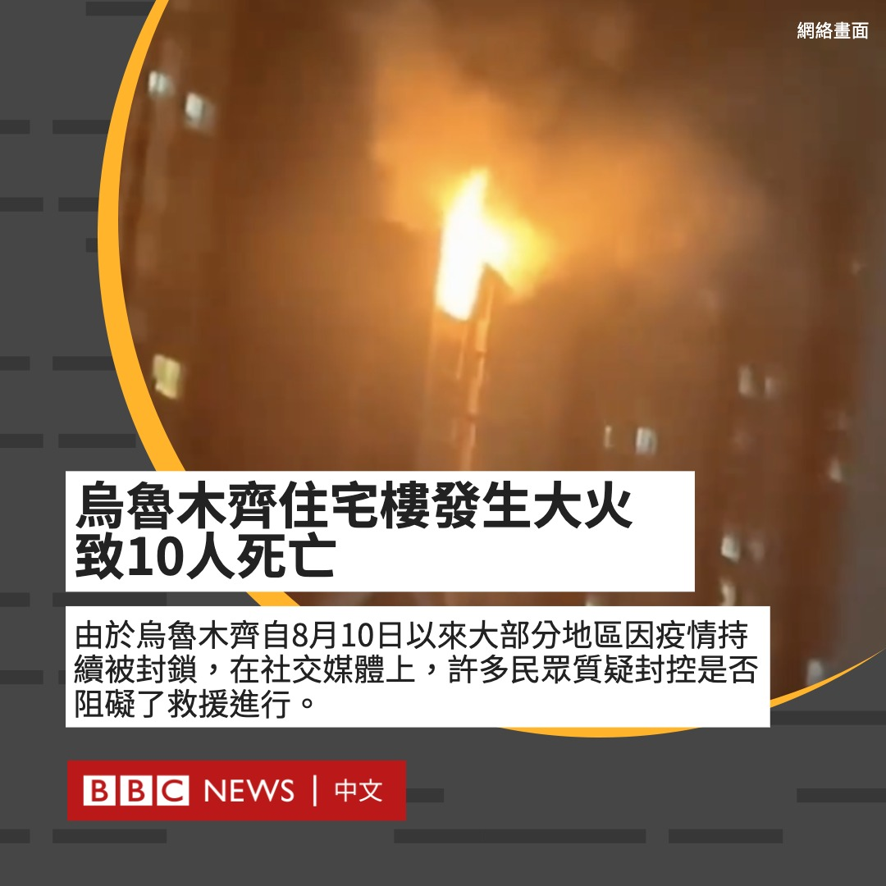

D英国广播公司BBC 北京时间 2022-11-25T17:40:59Z 1596076474678890496 中国新疆首府乌鲁木齐一栋高层住宅楼周四（11月24日）晚发生火灾。中国官媒报道称，火灾造成10人死亡，9人受伤。

据报道，火灾由接线板着火引起，火势由15楼起，其后蔓延至17楼。

由于乌鲁木齐自8月10日以来大部分地区都因疫情持续被封锁，在社交媒体上，许多民众质疑封控是否阻碍了救援进行。 https://t.co/ulY0ErpwHr   D英国广播公司BBC 北京时间 2022-11-25T22:03:51Z 1596142625723129861 中国新疆首府乌鲁木齐一栋高层住宅楼周四（11月24日）晚发生火灾。 中国官媒报道称，火灾造成10人死亡，9人受伤。乌鲁木齐自今年八月开始执行严格的新冠防疫措施，火灾发生后，中国网民表示质疑和愤怒。https://t.co/UYOZWa9OyX   