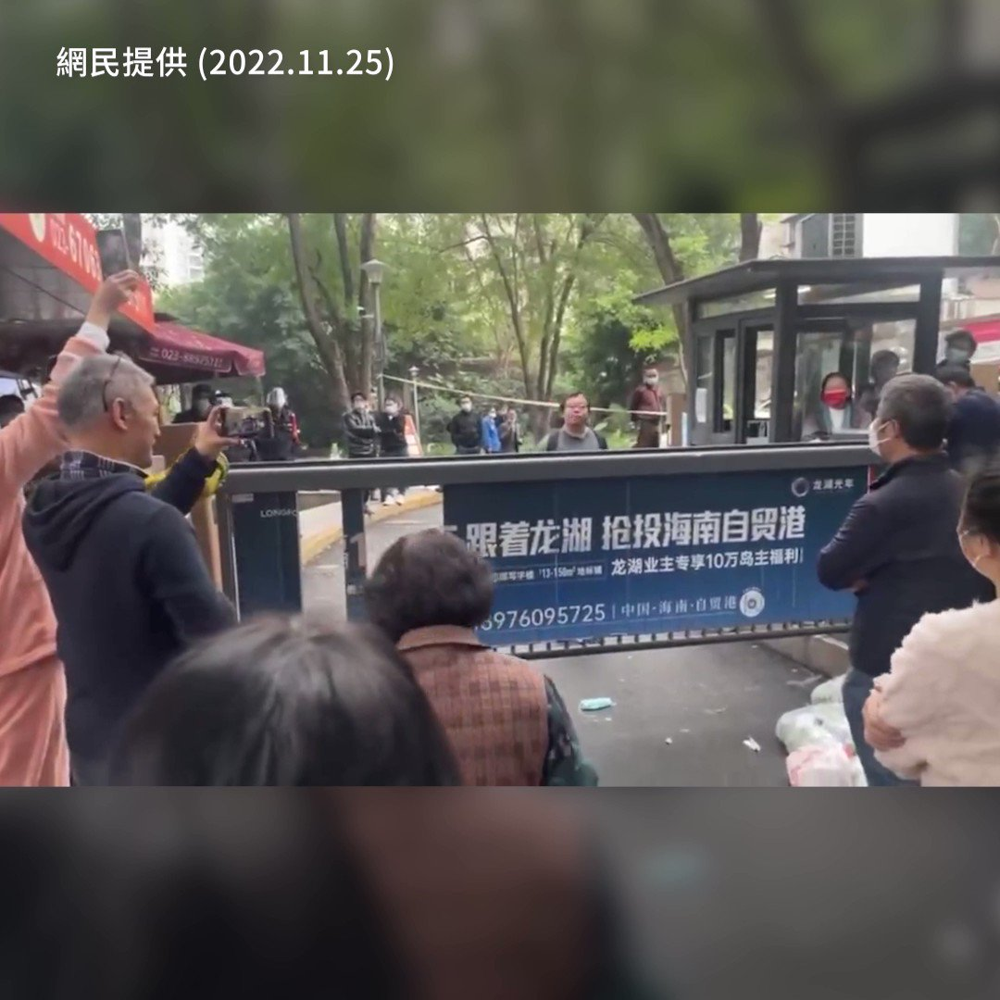

自由亚洲电台 北京时间 2022-11-25T17:43:55Z 1596077210867183616 【重庆“超人哥”痛斥防疫暴红被赞英雄】
【“#不自由和穷 我们现在全占了！”】
民众对于严厉封控与物价飙涨愤怒不已，一名“#重庆超人哥”大骂防疫的视频，金句尽出，他说“这个世界只有一种病，就是不自由和穷，我们现在全占了”。居民大力支持“超人哥”的仗义直言，称赞“你是大英雄”。 https://t.co/fHqtkjd2zQ   