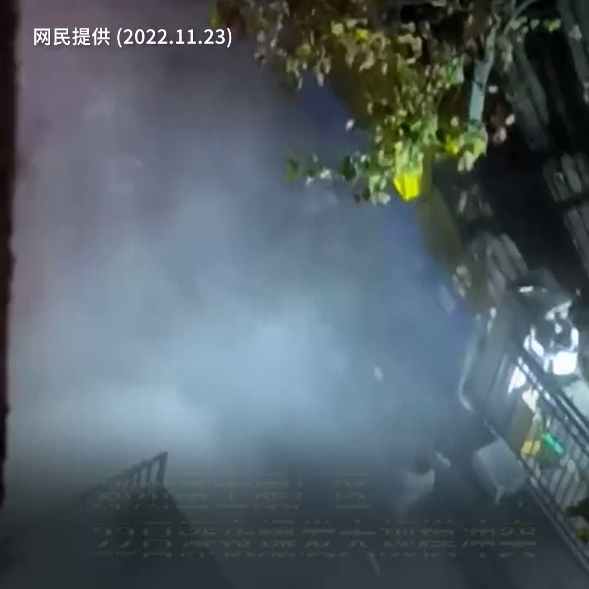

自由亚洲电台 北京时间 2022-11-23T13:51:23Z 1595293917112463360 【#郑州 #富士康 爆出大规模冲突】 
【深夜欲突围员工与警察对峙】 
郑州富士康祭出高薪招募时薪工，10万名额即将达标。 但22号深夜，厂区员工却再次爆发 #逃离潮。 工人对于待遇合同变卦不满，同时进入厂区后隔离条件不佳。 从22号深夜到次日凌晨，大批工人推翻围栏，大喊“维权！” 至23号上午仍对峙中 https://t.co/QGI7jb15GQ   