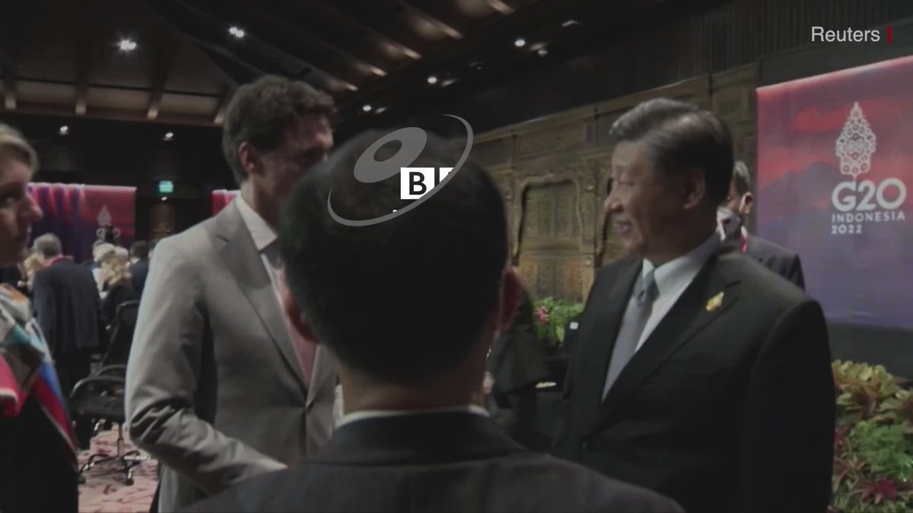

D英国广播公司BBC 北京时间 2022-11-17T10:19:26Z 1593066252490412032 中国国家主席习近平和加拿大总理贾斯汀·特鲁多（Justin Trudeau）在G20峰会上有过于生硬而尴尬的交流。

中国国家主席提到了两人闭门会议内容涉嫌泄密的担忧。

他说：“我们所有的讨论内容被泄漏到报纸，这是不合适的。” https://t.co/It19hXRh76   