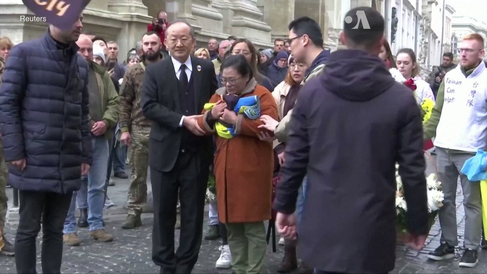

美国之音中文网 北京时间 2022-11-15T04:07:20Z 1592247834362773504 乌克兰军方11月14日在利沃夫为阵亡的台湾志愿兵曾圣光举行葬礼。曾圣光的母亲、夫人及姐姐等家属前往参加，也有不少乌克兰军人和民众到场致意。曾圣光现年25岁，今年6月离开台湾赴乌克兰参加国际志愿军。11月2日，曾圣光在乌克兰东部卢甘斯克地区与俄军交战时负伤阵亡。 https://t.co/7LUa8bUMjK   