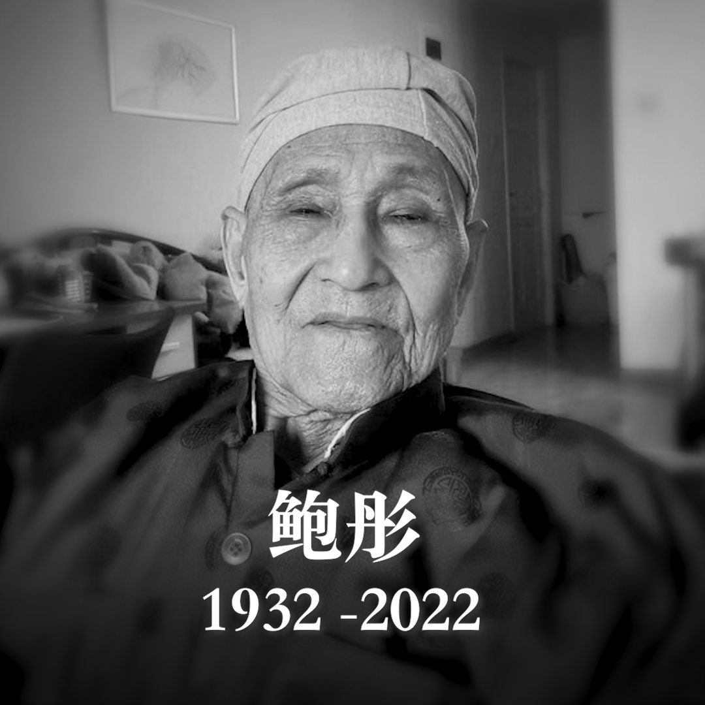

美国之音中文网 北京时间 2022-11-10T04:30:23Z 1590441694662561792 “我的90不90并不重要，重要的是我们大家要争取的未来，”四天前，被罢黜的前中共总书记赵紫阳的政治秘书 #鲍彤 在90岁生日当天留下一段5分多的录音，朋友称为“临终绝响”。 11月9日清晨他在北京去世。鲍彤在1989天安门血腥镇压前被撤职、逮捕、囚禁秦城七年，在此后的长期软禁中不畏阻挠地倡导民主宪政。 https://t.co/DMlK2s2Bnn   