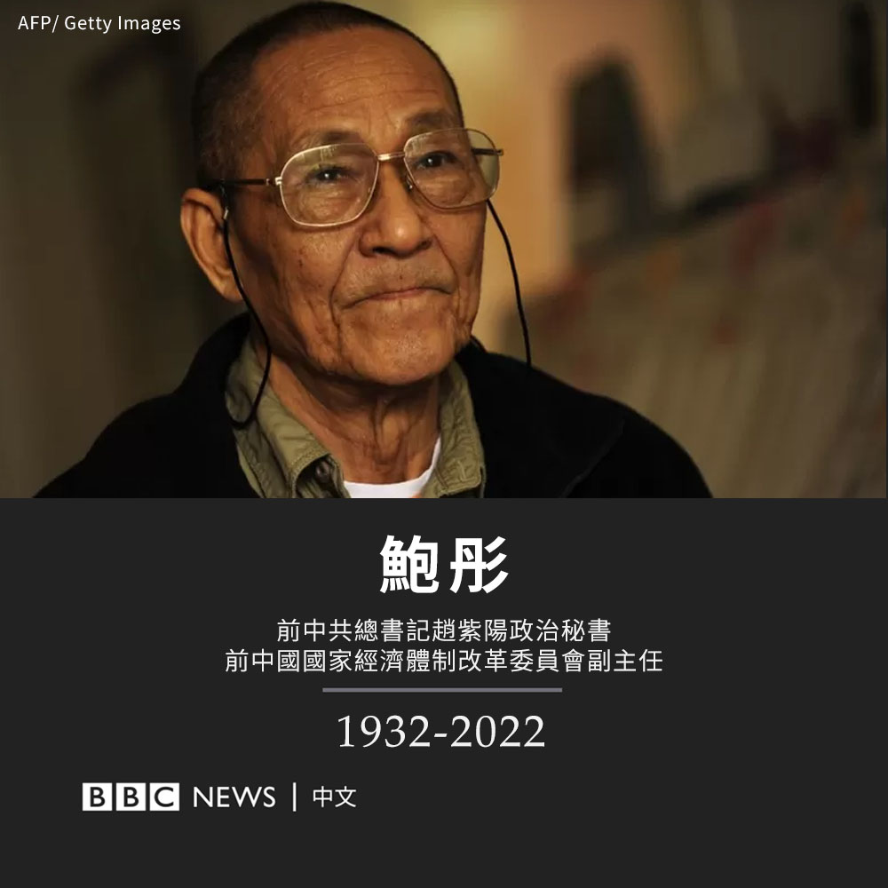

D英国广播公司BBC 北京时间 2022-11-09T22:40:20Z 1590353600647143425 前中共总书记赵紫阳的政治秘书鲍彤周三去世，享年90岁。其儿子鲍朴和女儿鲍简在社交媒体公布。

鲍彤曾担任中国国家经济体制改革委员会副主任，在1980年代辅助赵紫阳设计中国政治经济体制改革路线图。

1989年天安门民运中，他反对当局用武力镇压，最终被撤职并被捕入狱，后遭到持续软禁。 https://t.co/pvVw9EHWKu   