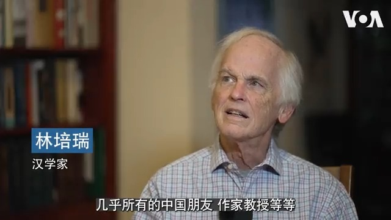

美国之音中文网 北京时间 2022-11-03T08:00:00Z 1587957732329418753 毛泽东造成的历史性饥荒和动荡一度被认为给未来的中国成功注射了防止文革式灾难的疫苗，但汉学家林培瑞认为实际上习近平正在重蹈覆辙，而毛还比习聪明得多，更有深度，更有分量，更有感召力。习近平的狭隘思维与民族主义结合后相当可怕，但政权其实很脆弱，因为中国社会已有很大不同。 https://t.co/T2peMzDsOZ   