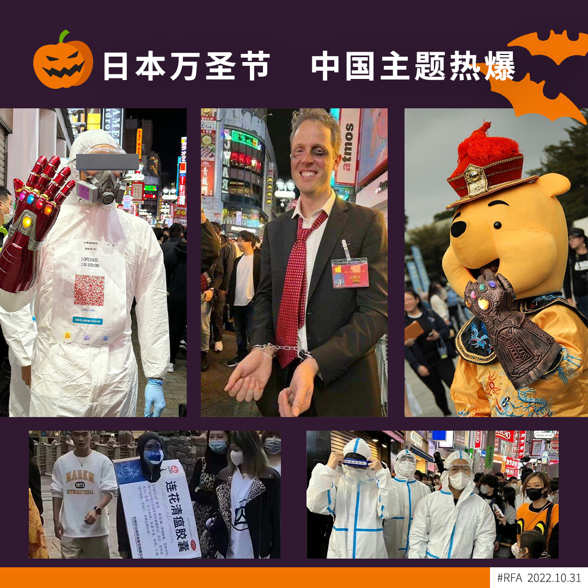

自由亚洲电台 北京时间 2022-10-31T18:08:21Z 1587023661642485761 【日本万圣节中国主题热爆】
【「胡锦涛」锋头一时无两】

在日本，今年庆祝万圣节，中国主题成为热爆题材，有人打扮成「大白」模样，也有人打扮成「穿着龙袍的维尼熊」，也有民众扮成「连花清瘟胶囊」，而最别出心裁的，可谓是在中共二十大闭幕当天被架走的「胡锦涛」。 https://t.co/H1NqtXUiKe   