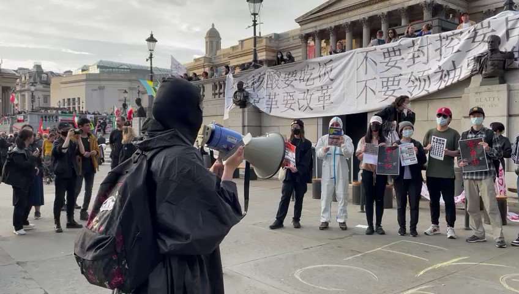

自由亚洲电台 北京时间 2022-10-30T01:03:47Z 1586403436303900674 【北京四通桥抗议鼓舞海外华人】
【伦敦华人罕见集会反暴政】

两个星期前出现在北京四通桥上的抗议标语，鼓舞了无数海内外中国人。有伦敦华人周六（29日）下午在伦敦市中心特拉法加广场举行”声援四通桥义士”活动，以行动告诉世人─”一个人的勇敢不应该没有回声”。

记者：吕熙（伦敦） https://t.co/SRM98S7A59   