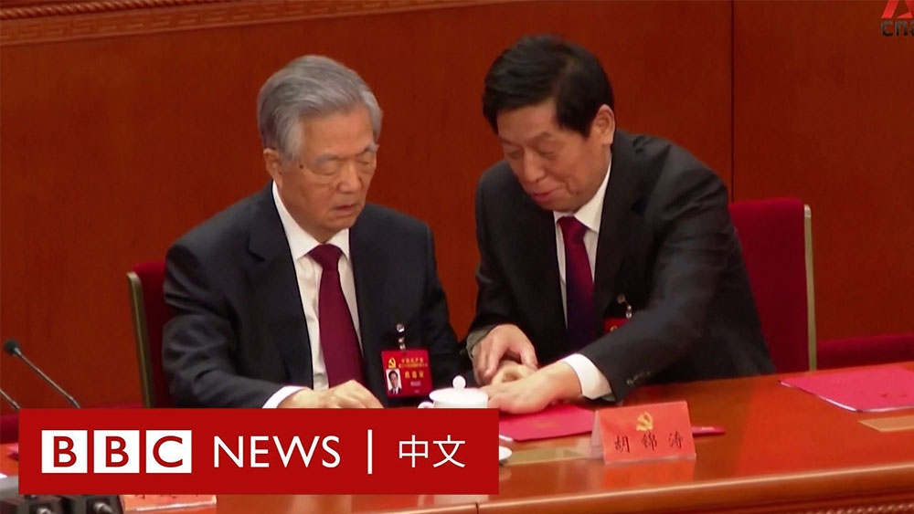

D英国广播公司BBC 北京时间 2022-10-26T14:50:31Z 1585161936731242497 中共前领导人胡锦涛10月22日在二十大闭幕会中途被搀扶离场，引发广泛关注。新加坡亚洲新闻台（CNA）日前公布一段新影片，展示了胡锦涛离场前的最后时刻。

中国官方尚未对此进行回应，但新华社英文推特账号早前以记者名义发文，称胡锦涛因“身体不适”而提前退场。

BBC并未对此影片进行任何删减。 https://t.co/kHqSMhtjJU   