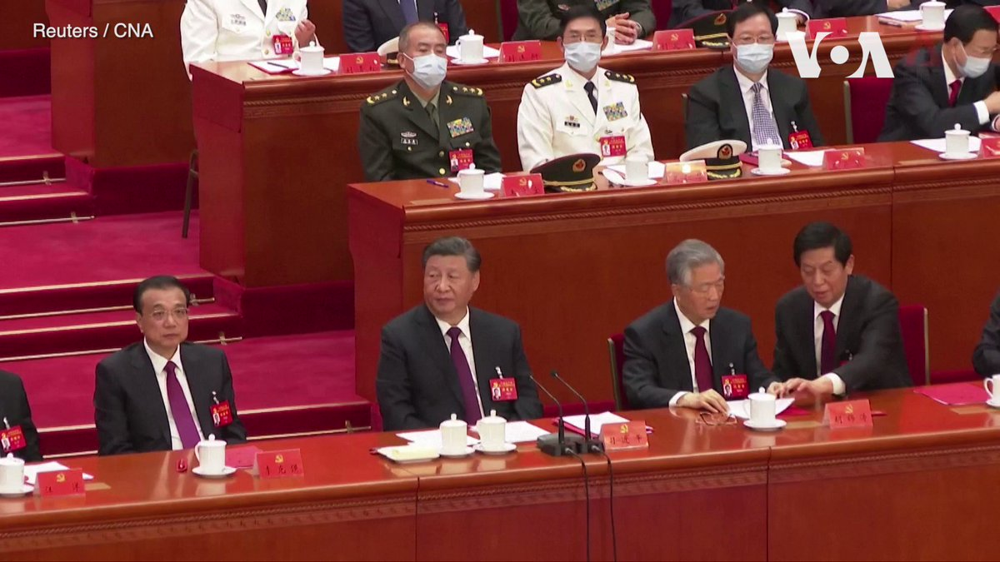

美国之音中文网 北京时间 2022-10-25T22:16:40Z 1584911829205405698 中共前总书记胡锦涛在10月22日中共20大闭幕式上被带离，舆论为此哗然。路透社获得的最新视频展示了胡锦涛离场前的最后时刻。这段由新加坡媒体CNA拍摄的将近3分钟的视频显示了胡锦涛与栗战书交谈，栗将胡手中的一份红色文件夹移走，习近平示意工作人员将胡锦涛带离会场的经过。 https://t.co/qw34wAdGDm   