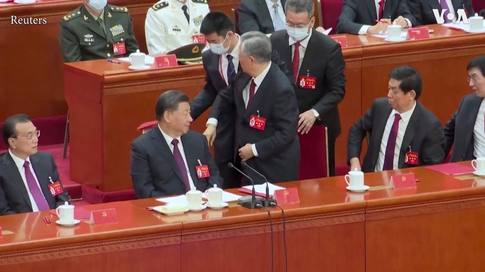

美国之音中文网 北京时间 2022-10-22T21:36:35Z 1583814578039042050 中共前总书记胡锦涛在22日的中共二十大闭幕式上令人意外地被带离会场。胡锦涛当时坐在习近平的左侧，由两名工作人员带离主席台。目前不清楚他被带离的原因，视频显示他似乎并不情愿离开。这次事件被认为很不寻常，相关视频在推特广泛传播，但在微博等中国社媒平台却找不到。
https://t.co/fIIUyE5IHl https://t.co/iwwH8NUNGW   