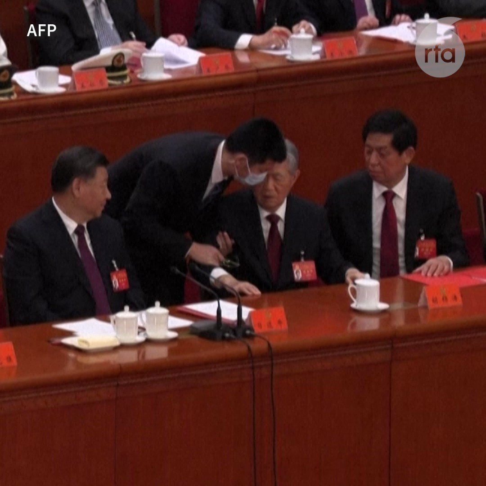

自由亚洲电台 北京时间 2022-10-22T14:39:54Z 1583709713895915525 【胡锦涛动作显示不自愿地被带离场】
【拒绝"被搀扶"、试图再坐下、拍打李克强手臂、习近平反应冷淡】
法新社画面显示，工作人员首先拿起了胡锦涛的眼镜，当尝试搀扶他时，胡锦涛右手缩回去，然后胡锦涛伸手拿习近平枱上的文件，工作人员即时制止。之后习近平头部转向相反方向，没有再理会胡锦涛。 https://t.co/Y32PJyksP1   