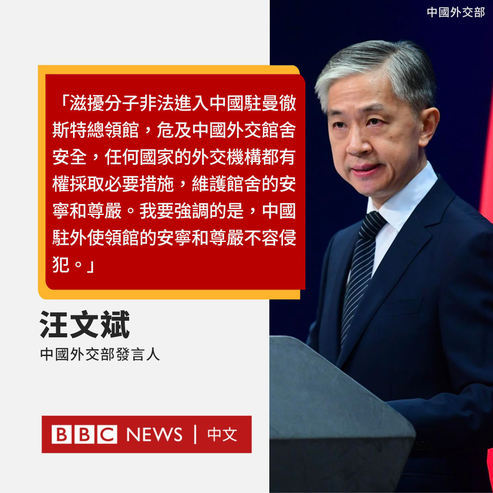

D英国广播公司BBC 北京时间 2022-10-18T17:04:43Z 1582296606279626752 中国外交部发言人汪文斌周二在记者会上回应曼彻斯特中国领事馆冲突时，指责该事件起因是“滋扰分子非法进入”领事馆。

他批评示威者“危及中国外交馆舍安全”，称“任何国家的外交机构都有权采取必要措施，维护馆舍的安宁和尊严”。

他还呼吁英国“采取有效措施，加强对中国驻英使领馆馆舍和人员的保护”。 https://t.co/AGZWsroPf2   