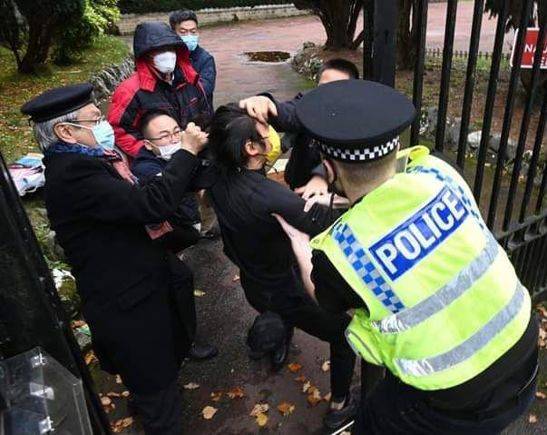

自由亚洲电台 北京时间 2022-10-17T04:28:00Z 1581743783590252544 【中国外交官拉香港示威者进领事馆殴打】
【英国警察及时营救示威者】
详细报道 https://t.co/rol9w6aVnV
英国曼彻斯特周日有香港人在中国领事馆抗议习近平连任。
有中国领事馆人员冲出来捣乱，并强行把部分示威者拉进领使馆范围，现场英国警察见状，把示威者从领事馆范围拉回来。
(图片由示威者提供) https://t.co/703DiJ0zD2   