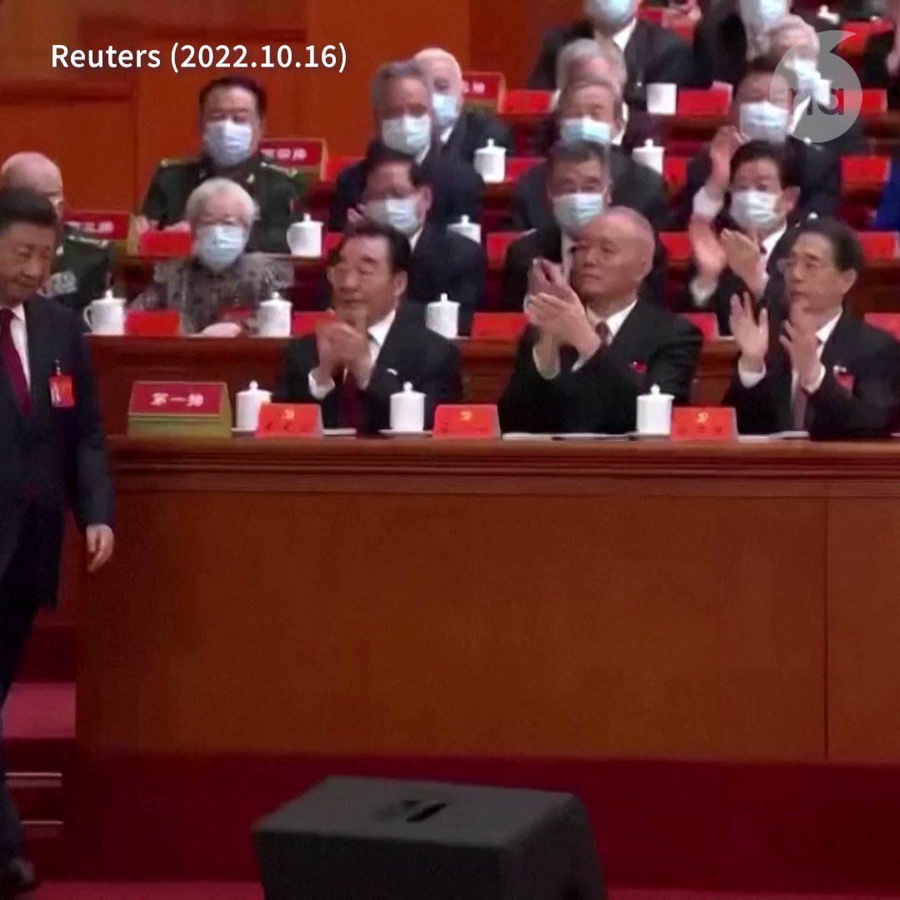

自由亚洲电台 北京时间 2022-10-16T12:39:42Z 1581505139235397634 【江泽民、朱鎔基、罗干、吴邦国缺席二十大开幕】
【李瑞环独树一帜全场拒绝为习近平鼓掌】
二十大的46个主席团成员中，有18位是元老，当中有四位缺席，包括江泽民、朱鎔基、罗干、吴邦国。
习近平走上台发表讲话时，全场热烈鼓掌，唯独元老李瑞环双手完全看不到有鼓掌的动作，眼神一直盯着习近平。 https://t.co/RNUr61IxYX   