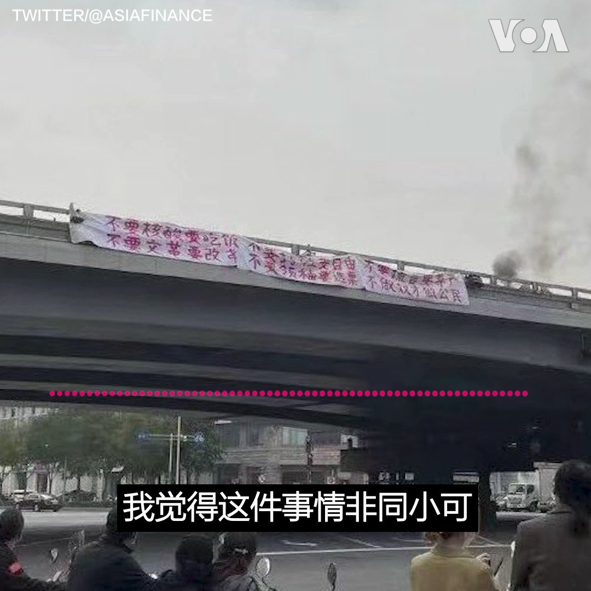

美国之音中文网 北京时间 2022-10-14T10:44:35Z 1580751393442365440 中共二十大前，北京四通桥上反习标语横空出世，震惊世人。“习当局是非常脆弱的，只要有一点点反抗的声音，他们就如临大敌，”前中共中央党校教授蔡霞说。前天安门学运领袖王丹说，不管这位勇士未来命运如何，他的壮举都将载入史册，告诉后代“即使是在最黑暗的时刻，中国还是有人会站出来。” https://t.co/Kfx153u4Mj   