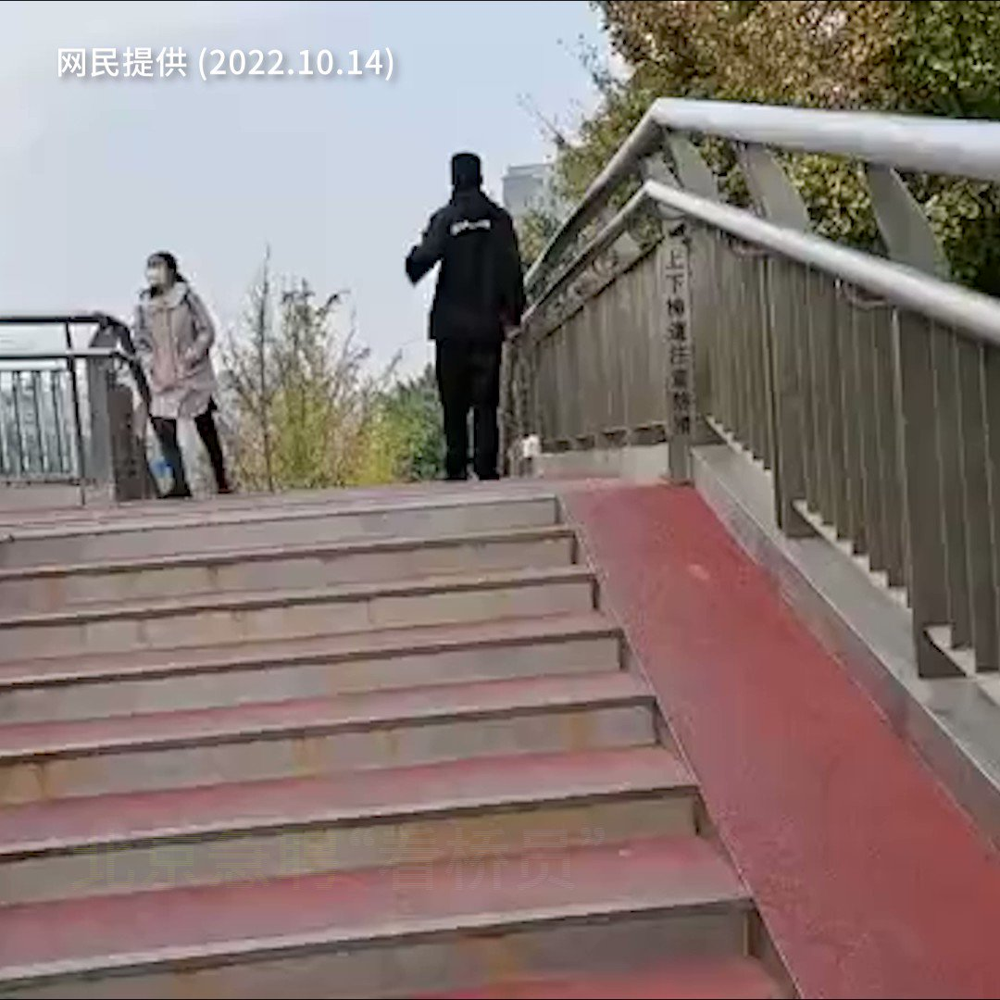

自由亚洲电台 北京时间 2022-10-14T15:49:26Z 1580828108202323973 【京城急聘24小时"看桥员"全天候监控】
北京四通桥周四被人挂上要求罢免习近平横幅后，北京市政府立即採取紧急措施，派出穿上民兵制服的人员连夜看守所有行车和行人天桥。
各区政府还刊登招聘广告急聘"看桥员"，分两班制24小时在桥上站岗，每天工资280至320元人民币，即每小时工资最多只有26元人民币。 https://t.co/axqRVa9xpu   