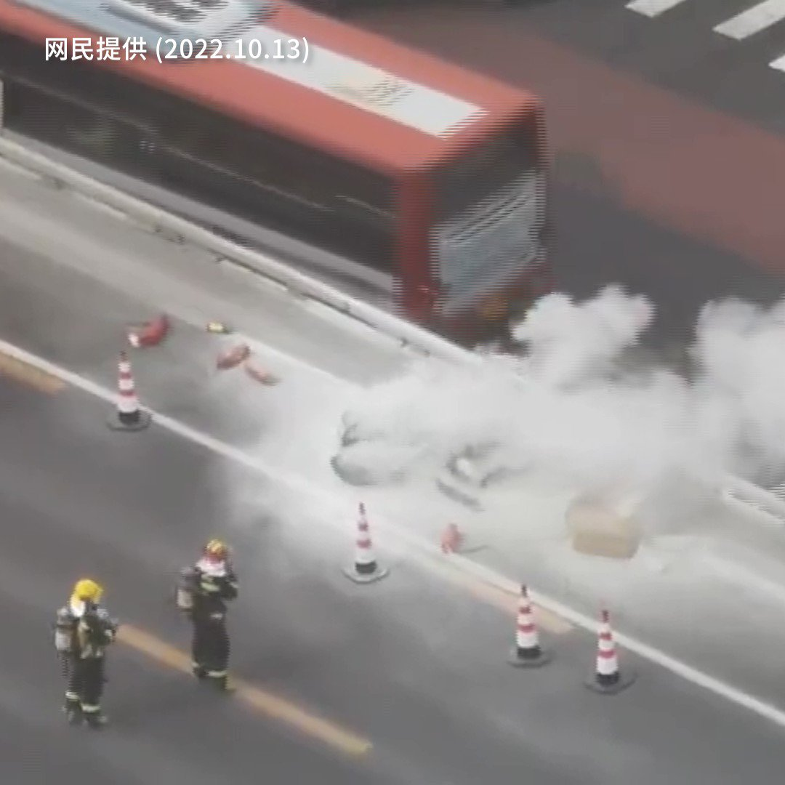
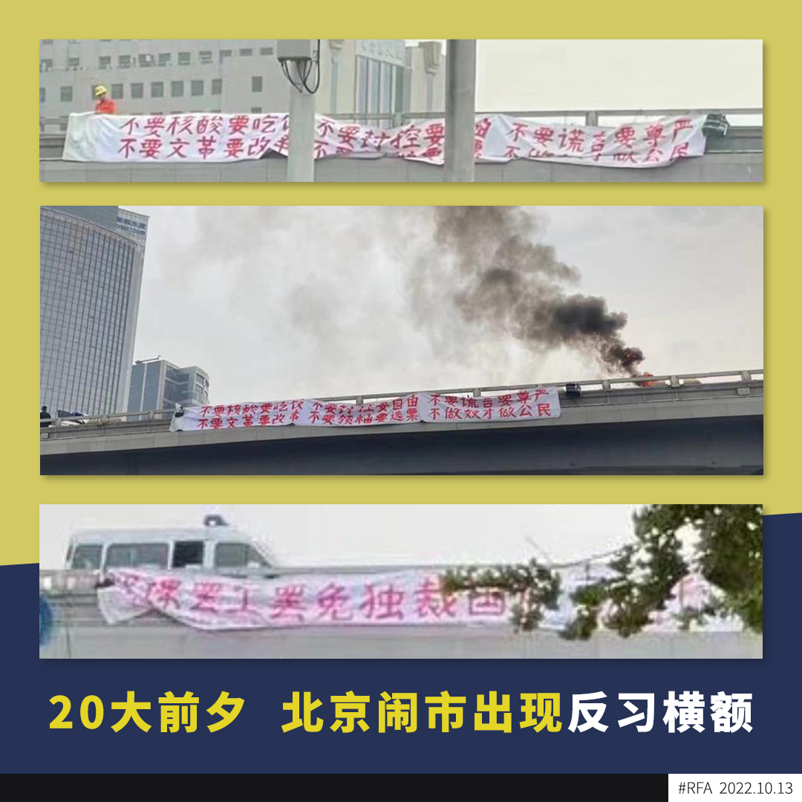

自由亚洲电台 北京时间 2022-10-13T19:16:48Z 1580517907284783105 【大陆全网封杀 “四通桥反习横幅事件”】
【牆内网民转发即”永久封号”】
北京四通桥出现反习、反封控横额后，牆内网络全面封刹相关消息，有网民在微信群转发该消息，只数分钟后就被”永久封号”。
在最新流传的视频可以看到桥面的情况，看到有杂物被燃烧，消防和公安人员到场，把一名男子带上警车。 https://t.co/6AVOyo77xW   自由亚洲电台 北京时间 2022-10-13T15:03:29Z 1580454158230237185 【北京闹市出现反习反封控、要求民主横额】
据大陆网民上载到社媒的照片，周四(13日)上午，在北京北三环四通桥上，有人挂上了一幅巨大横额 :
 "不要核酸要吃饭，不要封控要自由，不要谎言要尊严，不要文革要改革，不要领袖要选票，不做奴才做公民。”
而右边横额则写上 :
" 罢课罢工罢免独裁国贼习近平" https://t.co/qPR7H0WPj9   