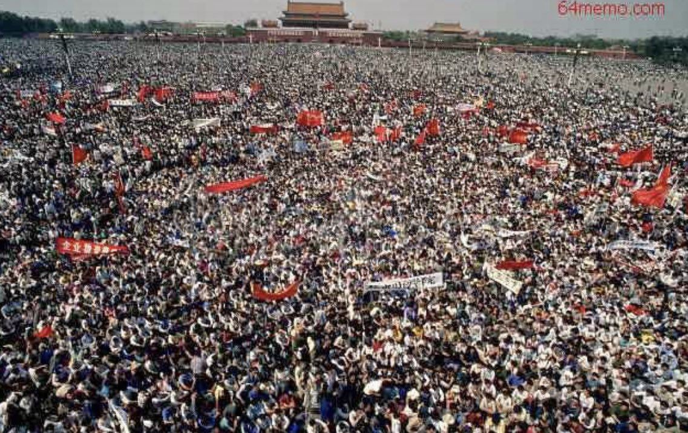

Ivy未央 北京时间 2022-10-09T07:44:25Z 1578894111163453440 发现一个规律，但凡一九四九以前的学生运动，从五四运动到一二.九到西安事变到47年反饥饿反内战，都是爱国运动！而一九四九后，包括四五运动、六四运动等等，所有的学生运动都是反动的，都是非爱国的，甚至都是境外势力煽动的。我忍不住思考，为什么“建国”以后，学生就变坏了呢？ https://t.co/HzLlYrEtJd   