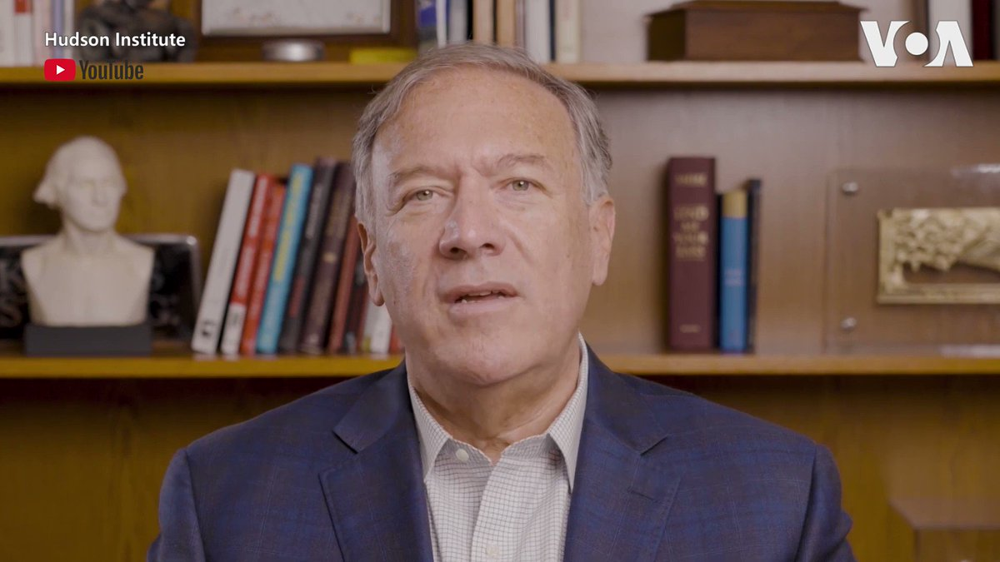

美国之音中文网 北京时间 2022-09-27T10:29:43Z 1574587059116851210 “历史上最反华的势力是中国共产党，它发动了一场摧毁千年中华文化的文化大革命，”美国前国务卿蓬佩奥星期一在“哈德逊夜话”@HudsonInstitute 系列视频最新一集中批评中共利用种族议题企图分裂美国人，并利用推特散播美国是个种族主义国家的谎言，但这与事实完全相反。https://t.co/LQBN56JXAJ https://t.co/ZMPoGUjSbI   