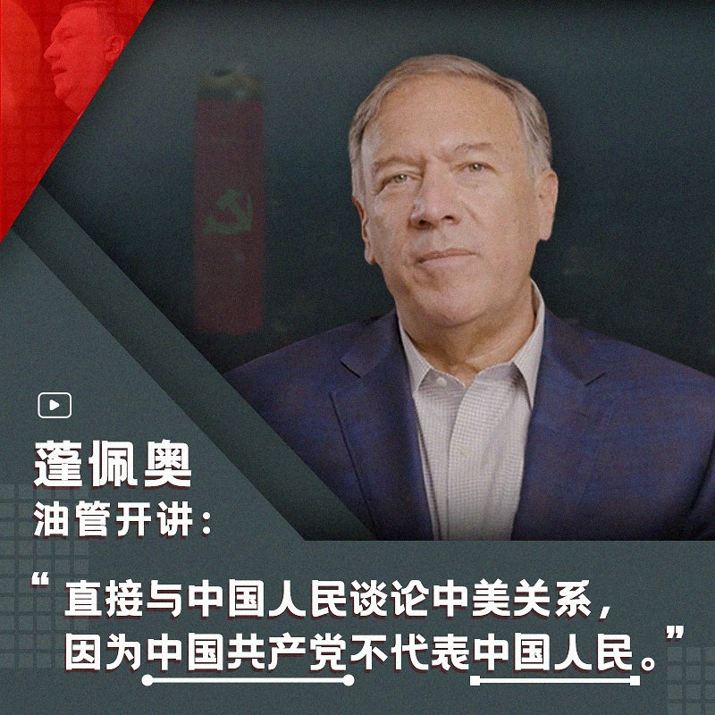

自由亚洲电台 北京时间 2022-09-15T06:30:00Z 1570178077539373056 美国智库 #哈德逊研究所中国中心 
 成立，#余茂春 当主任，#蓬佩奥 当谘询委员会主席，并亲自制作油管视频，直接与中国人民谈论美中关系、台湾、新疆、人权...
首期已发：https://t.co/noum318AnD
您预测蓬佩奥的视频能火吗？您认为多久更新一期为佳？他说 #中国共产党不代表中国人民，您同意吗？ https://t.co/X4exZ8ImKq   