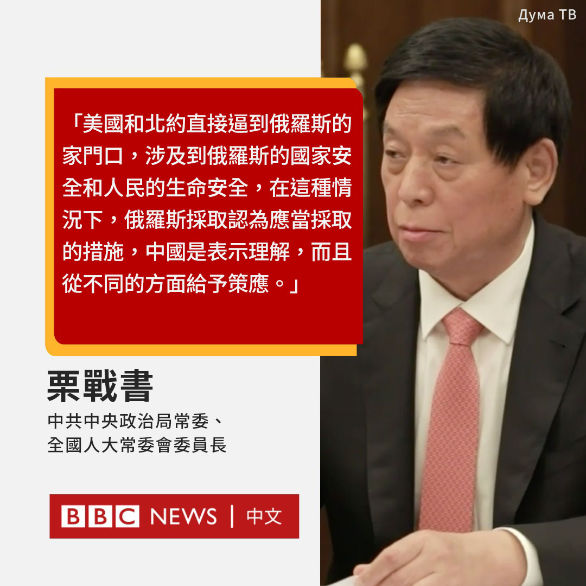

D英国广播公司BBC 北京时间 2022-09-14T14:13:25Z 1569932310551617536 中国全国人大常委会委员长栗战书上周在访问俄罗斯时，表达了对俄罗斯发动乌克兰战争的支持。

根据俄罗斯议会杜马电视台的画面，他对国家杜马主席沃洛金说，北约将俄罗斯“逼到了墙角”，莫斯科的行动是“一次反击”。

栗战书是中国位列第三的领导人。这是北京迄今为止对莫斯科作出的最有力的支持性表态。 https://t.co/2JN5Apn66e   