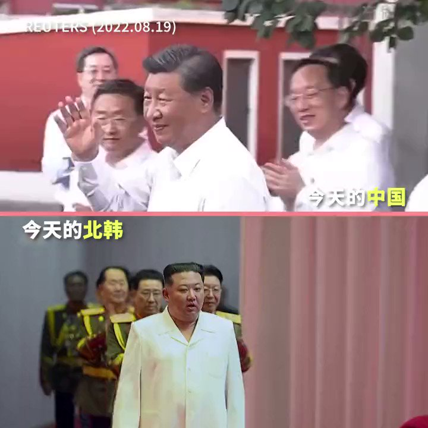

自由亚洲电台 北京时间 2022-08-19T23:38:05Z 1560652330999001090 【新闻画面显示习近平与金正恩看齐】
【网民 : “中国正在朝鲜化”】
中国官媒由周四(18日)起，铺天盖地宣传习近平视察东北。中央电视台新闻联播用了18分钟报道习近平的行程，人民日报19日头版全是习近平。 在习近平视察的视频中，群众表情激动。
有网民感叹，这些画面跟朝鲜官方宣传何其相似。 https://t.co/YBbtkhvN9N   