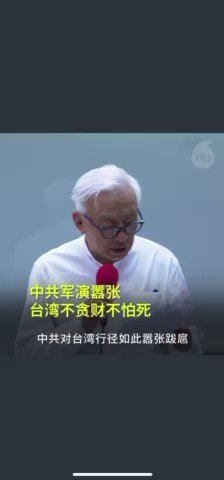

Petrichor 北京时间 2022-08-06T04:08:04Z 1555646843148705794 美国众议院议长佩洛西离开后，中共对台实施实弹军演。台湾晶圆代工大厂联华电子(联电)荣誉董事长曹兴诚8月5日召开记者会宣布，将捐赠1亿美金协助台湾加强国防。曹兴诚说，中共行径嚣张跋扈，希望台湾人不要贪生怕死，起来战斗。他说"中华人民共和国是一个仿冒成国家形式的黑社会组织"。 https://t.co/zCGa4GdavL   