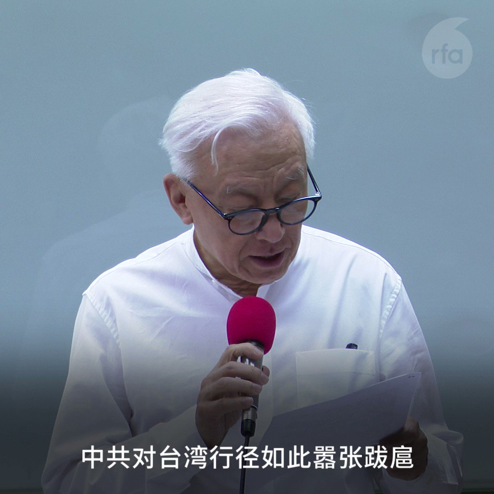

自由亚洲电台 北京时间 2022-08-05T14:46:16Z 1555445063341129728 【#曹兴诚 捐30亿台币助台湾国防】
【称中国是仿冒形成的黑社会组织】

台湾联电荣誉董事长曹兴诚说，中共破坏区域和平稳定，打击台湾民心士气，动摇民主自由信心，他呼吁台湾人认清中共邪恶本质，团结保卫家园。曹兴诚宣布捐30亿台币(约1亿美金)加强国防。他还说中国就是一个仿冒形成的 #黑社会组织。 https://t.co/ZZnPTlYGW4   