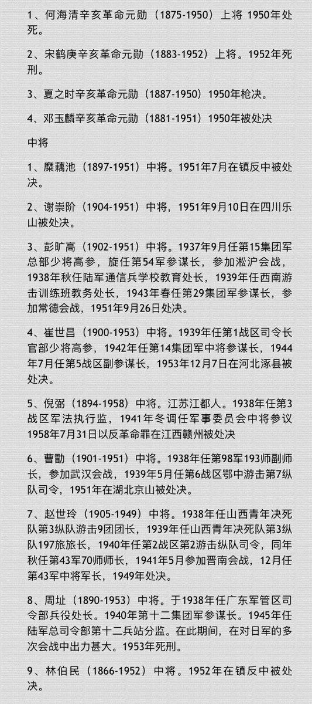
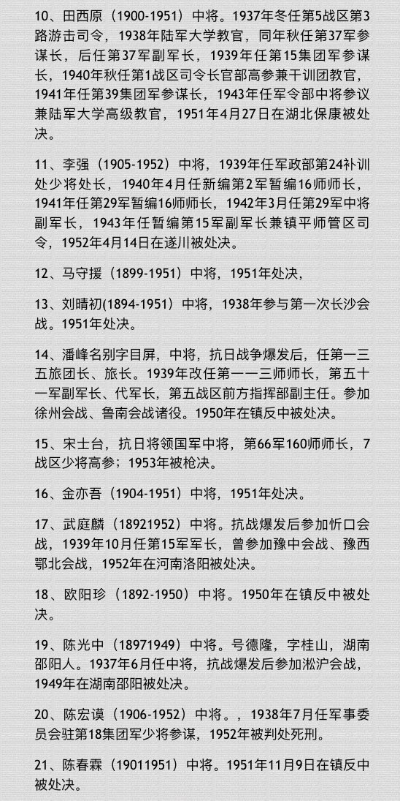
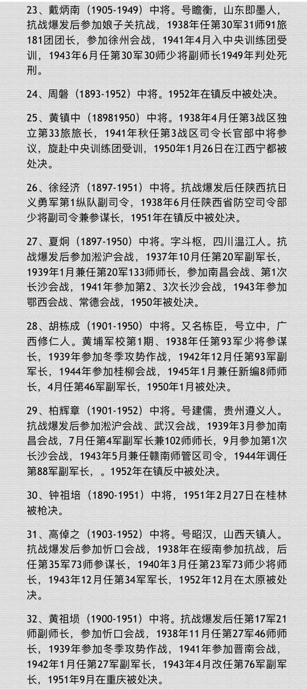
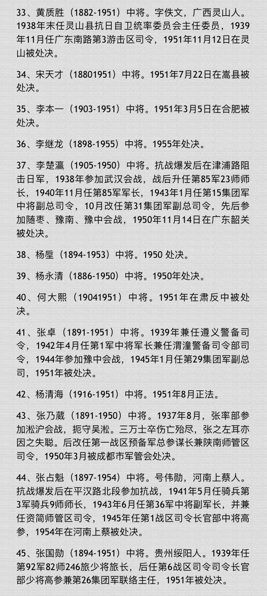

Petrichor 北京时间 2022-07-25T11:40:14Z 1551411981869088769 比南京寺庙供奉日军四位战犯更令人羞耻的，是242名中国抗日名将在1949 年后被中共作为历史反革命而慘遭杀害，其中上将5名、中将78名、少将159名。相反，被中共关押的1062名日本战犯中，1017名分批释放，只有40名罪行严重的分别判处8—20年有期徒刑，没有一个判死刑。你们如何看待这件事？请发言。 https://t.co/hEIYa9mEg3   