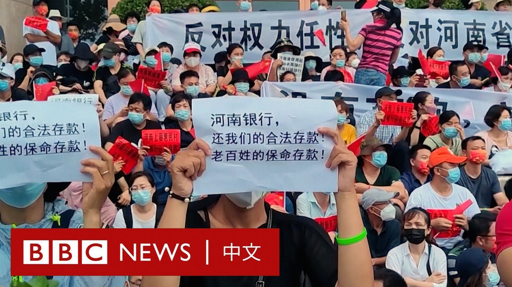

D英国广播公司BBC 北京时间 2022-07-11T19:01:06Z 1546449498637012993 7月10日，在河南中国人民银行郑州支行门前，大批维权人士在与警方对峙时，遭到不明身份人士的殴打和驱散。参与集会的人士呼吁当局解决河南四家村镇银行无法取款的问题。这可能是中国近年来最大的金融丑闻之一。

警告⚠️：影片内有暴力场面。

详细报导：https://t.co/eg7sd1n1BT https://t.co/Mg5BVrWHVX   