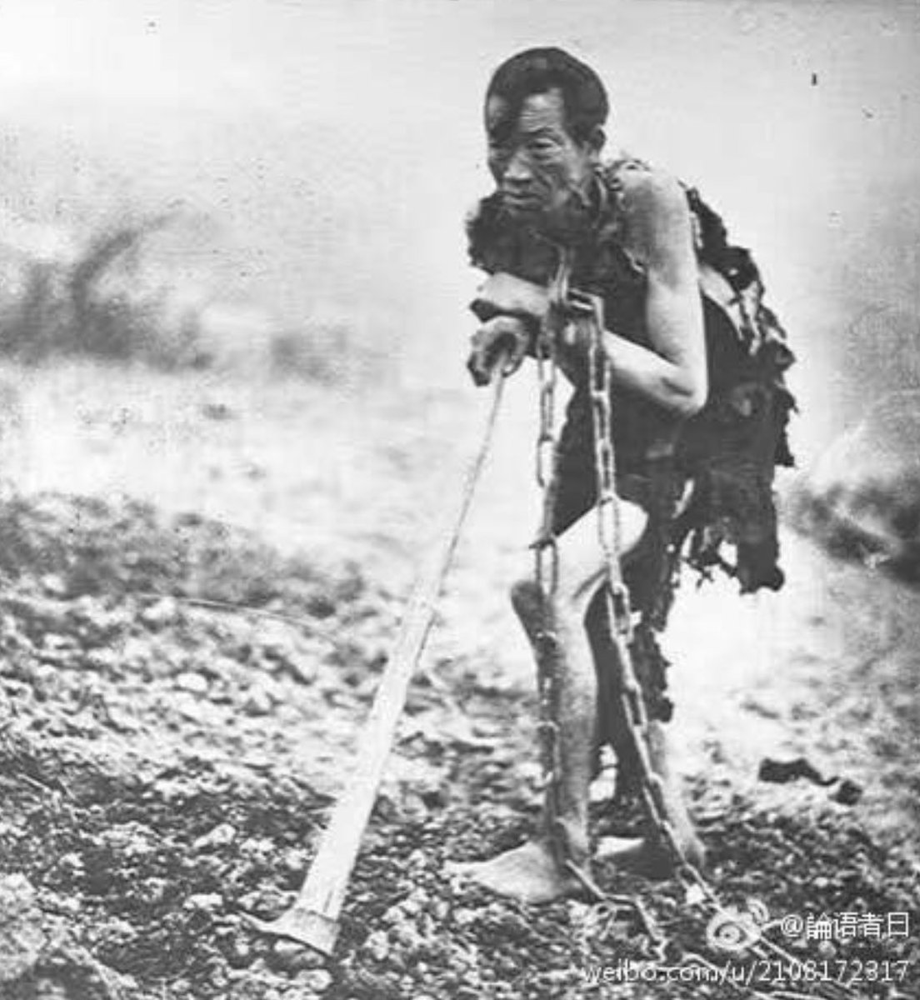

Ivy未央 北京时间 2022-07-10T22:06:20Z 1546133723766218757 转）闲来无聊翻阅了一下小时候的课本，无意中看到了对奴隶制社会的解释： 
一、奴隶没有土地； 
二、奴隶的财产来自于奴隶主的分配； 三、奴隶没有政治权力，不能参政议政； 四、奴隶要热爱奴隶主，不得背叛； 五、奴隶有保卫奴隶主的义务。 
于是我泪奔了，tmd怎么说得这么像我？ https://t.co/kqXDIDRG28   