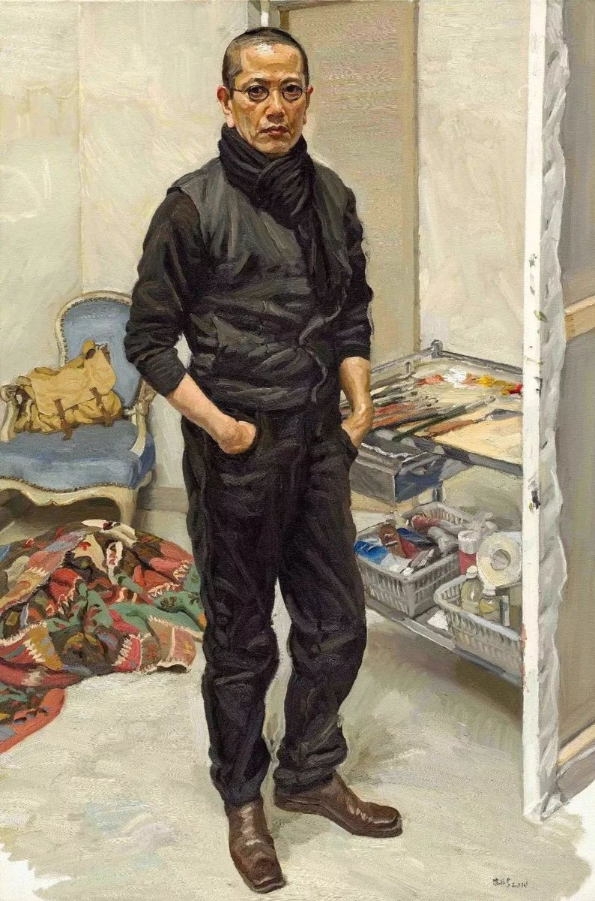
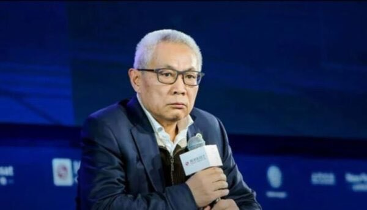

Ivy未央 北京时间 2022-06-30T22:01:00Z 1542508503750758402 据说陈丹青说的：如果你们销毁外国签证，我就相信你们是爱国的；如果你们把妻儿移民朝鲜，我就相信社会主义是优越的；如果你们把文工团取消，我就相信你们扫黄是真心的；如果你们把财产公开，我就相信你们是诚心反腐的；如果你们给民选票，我就相信你们是真正为民服务的。如果不是这样，凭什么相信你？ https://t.co/zchXD0s57Z   Ivy未央 北京时间 2022-06-30T06:10:22Z 1542269268661833731 转）什么叫稳定的国家？
人人都可以持枪，却没人想着闹革命； 人人可以骂官，官却不能骂民； 到处有人抗议，却没有人趁机闹事； 媒体充斥坏消息，却没人想着移民； 政府可以随时倒台，但百姓房屋绝不会被强拆； 航空航天可以出事，但食品药品绝对安全； 有最先进的军队和武器，却只留着对外。 ——任志强 https://t.co/i4VlDiTWMU   