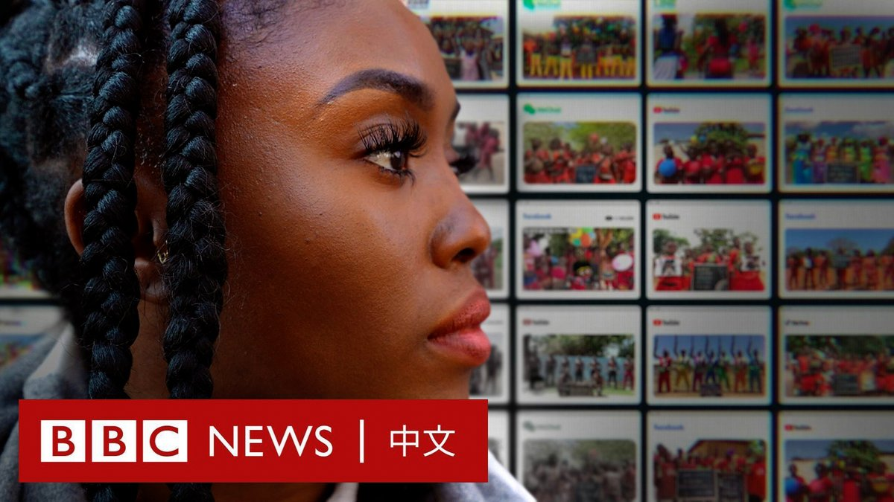

D英国广播公司BBC 北京时间 2022-06-15T20:01:08Z 1537042519548125185 “我是黑鬼，智商低……”2020年，一段非洲儿童被教导用汉语侮辱黑人的影片在中国社交媒体上传播。

该影片在中国国内和其他地区都引发愤怒，但它在哪里拍摄、拍摄者是谁一直是谜团。

BBC《非洲之眼》花费数月时间，调查这背后的视频制作产业。令人震惊的是，它并不仅限于歧视，还涉及虐待和剥削指控。 https://t.co/F9nXOg56YL   