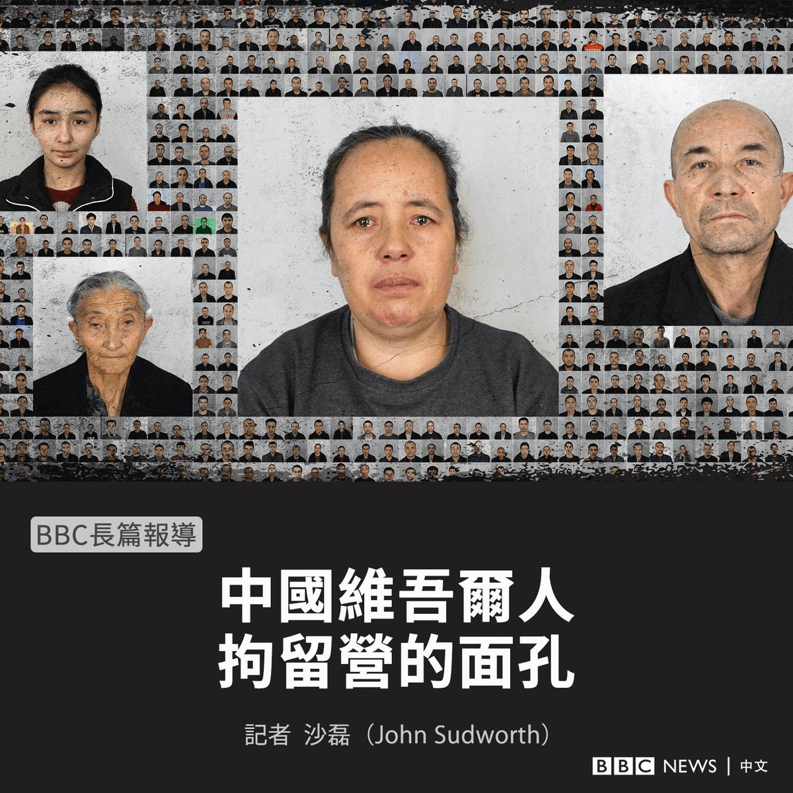
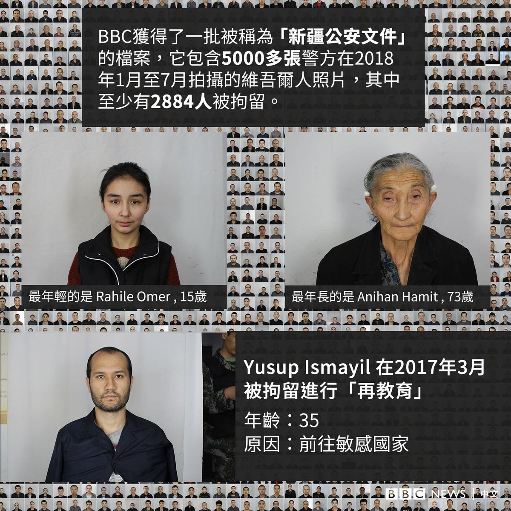
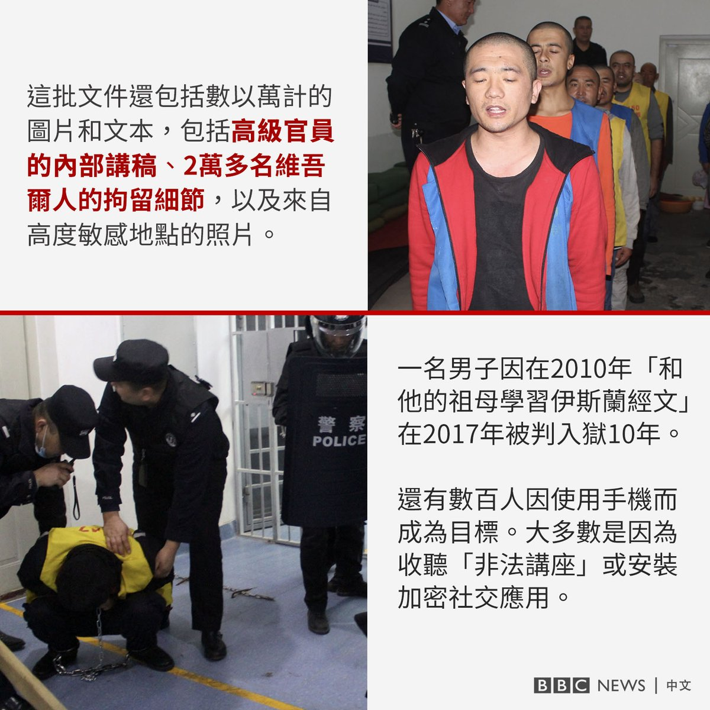
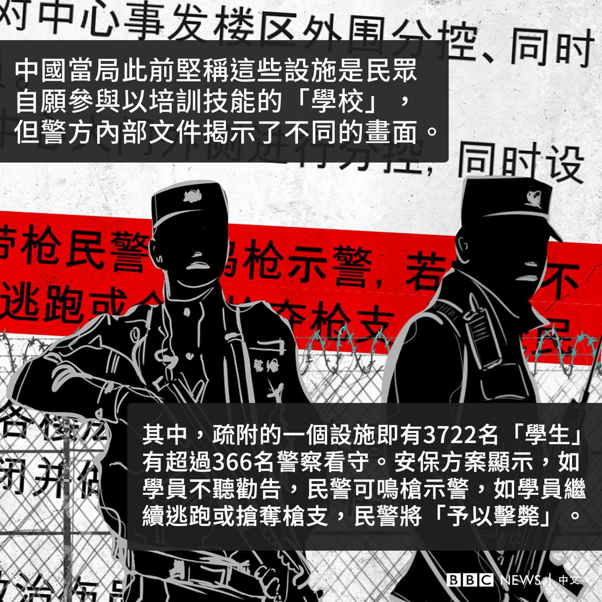

D英国广播公司BBC 北京时间 2022-05-24T19:11:59Z 1529057618014117889 BBC获得了一批被称为“新疆公安文件”的档案，其包括数千张来自中国新疆高度保密的大规模监禁系统的照片，以及当局对试图逃跑者可能开枪的严厉政策文件。

该文件据称是由黑客获得并分享给十余家媒体。BBC对其进行了长达数月的调查和鉴定，以验证其真实性。

阅读完整英文报道：https://t.co/z6varbVBhs https://t.co/a6aFrDlWs5   