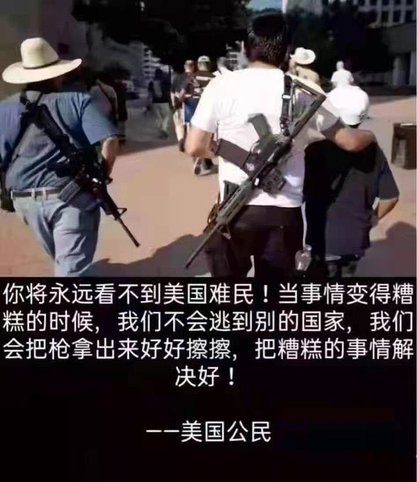

Ivy未央 北京时间 2022-05-18T08:24:52Z 1526720438679764992 美国开国元勋们知道，选民可能选出一个坏蛋当总统，所以设立两院加以限制。两院议员也不一定可靠，又设立大法官加以法治。大法官也许无知或被收买，所以不允许官方办媒体，让媒体获得特权：言论自由。最坏事情发生咋办：政府强权，两院失职，媒体失声。百姓最后的抗衡手段：持枪权——美国精神的精髓 https://t.co/FODM9oUtzo   