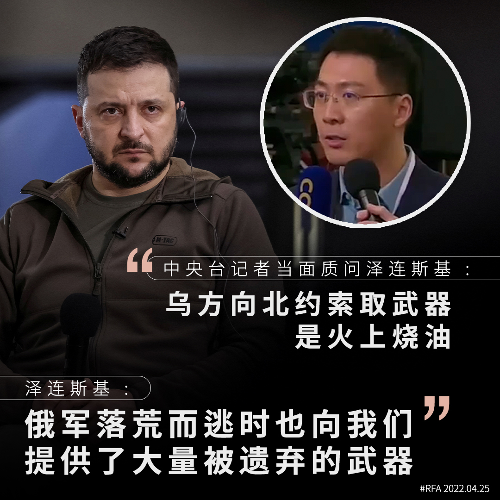

自由亚洲电台 北京时间 2022-04-25T15:41:21Z 1518495364701163521 【中央台记者质问泽连斯基索武器是 “火上烧油”】
【泽连斯基反讽落荒而逃俄军提供了大量武器】
周六(23日) ，乌克兰总统泽连斯基在基辅的地铁站召开记者会。来自全世界多国记者均有参与，当大部分记者询问泽连斯基如何抵抗俄军入侵，与及和谈的进展和机会时，中国官媒CGTN记者问了不一样的问题。 https://t.co/A60VlQOKhw   