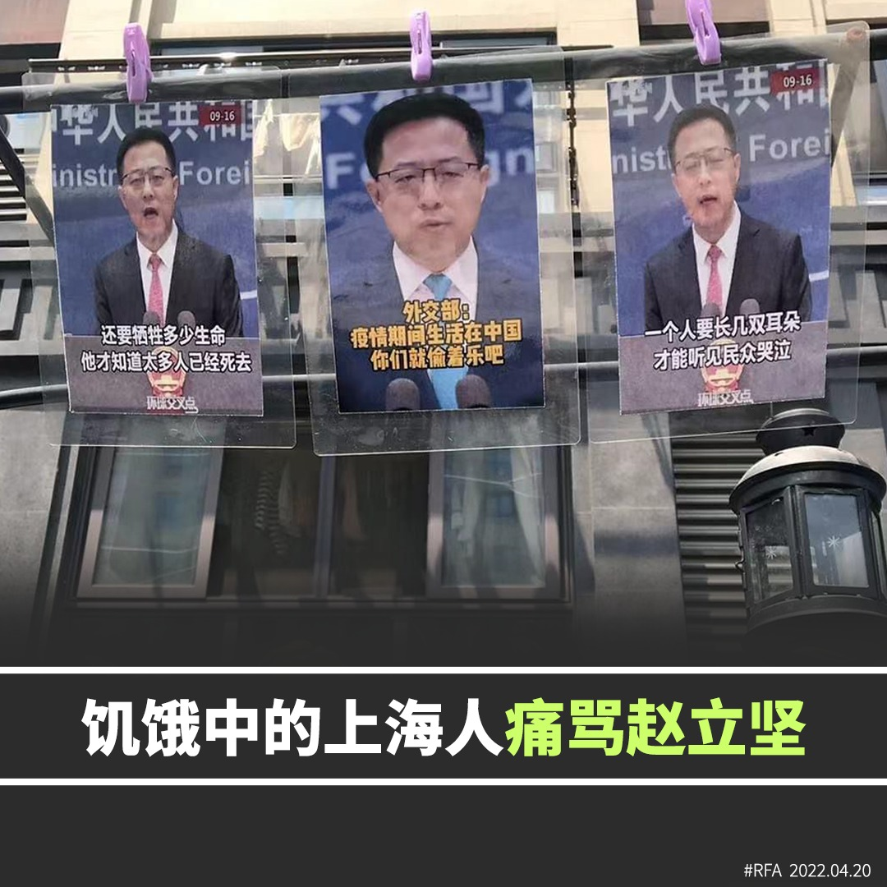

自由亚洲电台 北京时间 2022-04-20T14:25:48Z 1516664412291051520 【赵立坚成为上海人痛骂对象】
中国官方很多时对外发放不实信息，在上海封城期间更是表露无遗。
有上海民众不满中国外交部对外发放不实信息，在街上挂上赵立坚的肖像，并写上”一个人要长上几双耳朵? 才能听见民众哭泣”，”还要牺牲多少生命? 他才知道太多人已经死去。”
#上海封城
#赵立坚
#战狼 https://t.co/25TzvZ6BeS   