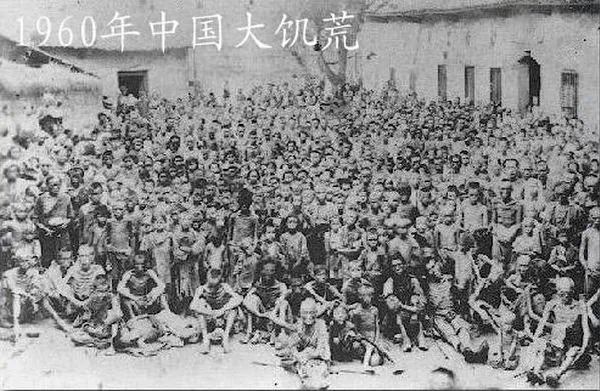

Ivy未央 北京时间 2022-04-15T19:56:25Z 1514935672959913991 三年大饥荒，火车站、汽车站、码头等均设阻止外出逃荒的劝阻站。1960年，一外流人员带全家逃荒，在辛店火车站被劝阻，令返原地。外流人员说：“要不是饿的人吃人，谁往外逃荒。”“你这是造谣破坏”劝阻人员对其打骂。外流人员抽出菜刀相威胁，被公安冲锋枪击毙。
这个如今军队进驻上海封城有点像不？ https://t.co/ymECEhWUq4   