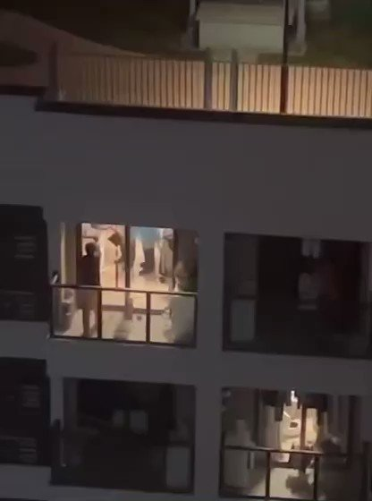

自由亚洲电台 北京时间 2022-04-13T12:25:20Z 1514097379607121921 【武装部队进入上海民居抓人隔离】
越来越多上海市民誓死拒绝到方舱隔离，不少上海人虽然拿着阴性报告，仍被强行送到方舱。 在这情况下，当局开始出动武装人员闯进民居，用上各种武器制服反抗的居民。
(上海网民提供视频)
#上海封城
#武装部队
#shanghai https://t.co/dtsaGHSUmP   