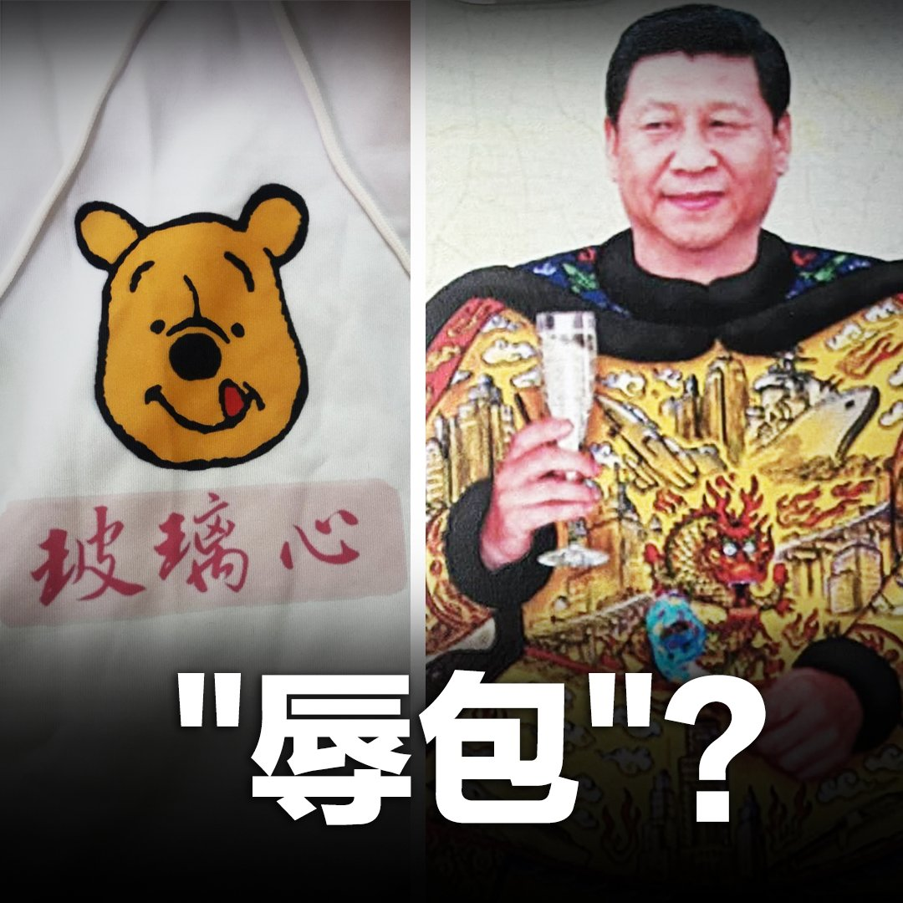

美国之音中文网 北京时间 2022-04-08T09:00:00Z 1512233766135107585 伴随着中国政治、经济全面倒退，国际环境空前恶化，举国清零政策搞得民不聊生，防火长城外恶搞、讽刺、侮辱 #习近平 的作品层出不穷。几位"#辱包"人士告诉美国之音，这些黑色幽默的背后是中国人的愤怒、无奈与抗争。
https://t.co/CB9EK2fLcq https://t.co/ACQjbg3tHU   