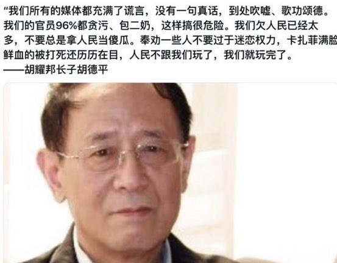
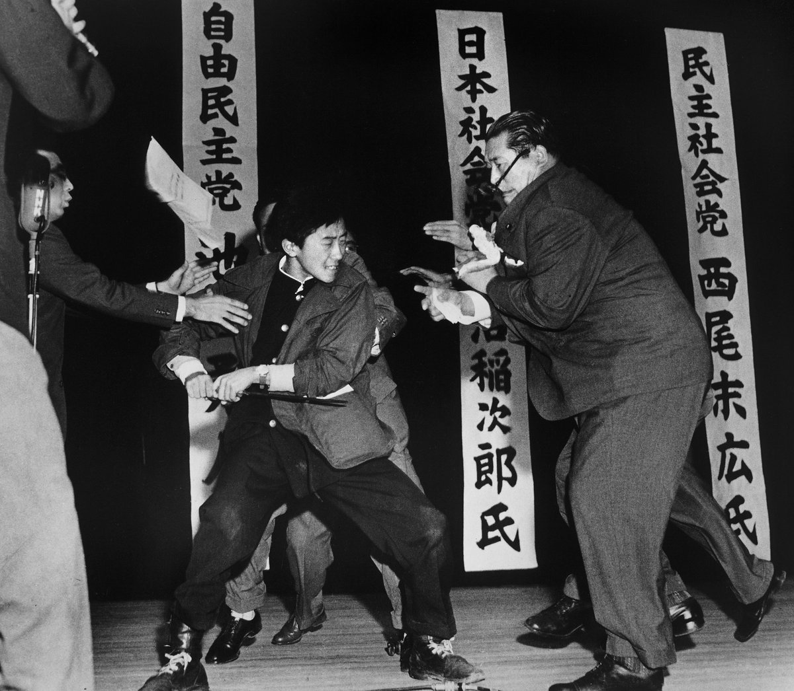

Ivy未央 北京时间 2022-04-06T19:36:55Z 1511669275039313927 胡耀邦的长子胡德平在微博上说：我们所有的媒体都充满了谎言，没有一句真话，到处吹嘘、歌功颂德。我们的官员96%都贪污、包二奶，这样搞很危险。我们欠人民已经太多，不要总是拿人民当傻瓜。奉劝一些人不要过于迷恋权力，卡扎菲满脸鲜血的被打死还历历在目，人民不跟我们玩了，我们就玩完了。 https://t.co/g6kuH98SCE   Ivy未央 北京时间 2022-04-06T08:13:23Z 1511497258356953090 1960年10月12日，日本青年山口二矢在众目睽睽之下用短刀刺杀了当时大选热门日本社会党领袖浅沼稻次郎，彻底葬送了共产主义在日本的发展。当时这孩子衣兜里有封短信，大意是“我与您并无私仇，但我不能让您毁了日本，对不起。”20天后，在少管所上吊自杀，年仅十七岁。
如今看，这个17岁少年郎真英雄啊！ https://t.co/uDvGhI1rR4   