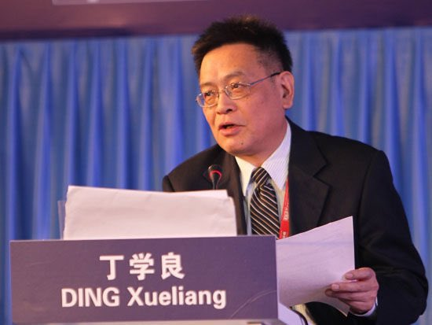

Ivy未央 北京时间 2022-03-26T06:24:43Z 1507483644281208837 转）香港科技大学教授丁学良，曾研究大陆某公安厅领导如何用上亿国家资产赚钱，被警告说会被杀掉，而且死了白死！他被迫停止研究。“当你接近中国最高层子女、亲属、亲信那个级别，你基本上已经走到了权力核心，他们敢于践踏一切法律，包括剥夺你生命，使你无法调查下去…”
中共高层杀人随心，你信吗？ https://t.co/lFH9fXmXp5   Ivy未央 北京时间 2022-03-26T21:13:00Z 1507707187665289221 转）台湾有一项政策，所有吃不饱的孩子，都可以到指定便利店领免费便当。一位台湾导游不明白的是，总有大陆游客听说后问她：怎样防止有孩子去冒领便当？她觉得特别奇怪，如果可以吃饱了，谁愿意去领免费的便当呢？人是需要尊严的啊！她不知道，在地球上有些国家，尊严远不如一盒便当值钱。   