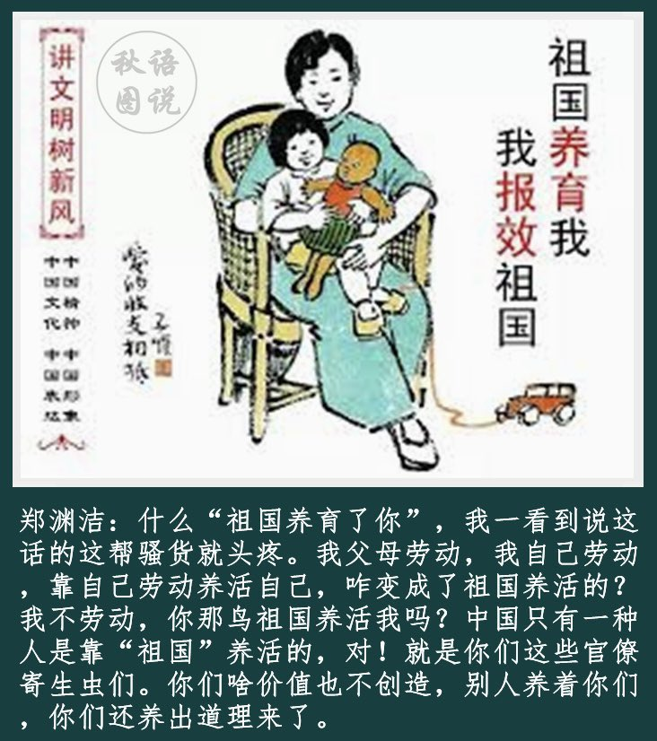

Ivy未央 北京时间 2022-03-25T07:07:56Z 1507132134158442497 郑渊洁:什么“祖国养育了你”,我一看到说这话的这帮骚货就头疼。我父母劳动,我自己劳动 ,靠自己劳动养活自己,咋变成了祖国养活的? 我不劳动,你那鸟祖国养活我吗?中国只有一种人是靠“祖国”养活的,对!就是你们这些官僚寄生虫们。你们啥价值也不创造,别人养着你们 ,你们还养出道理来了。 https://t.co/qck18Cs99c   Ivy未央 北京时间 2022-03-25T20:22:14Z 1507332024167714820 转）两千多年前，孟子发了一条微博：“民为贵，社禝次之，君为轻。”叫好一片，点赞持续了两千多年。今有好事者将其翻译成白话文：“人权大于主权，党和国家领导人不应享有特权！”微博立马被删，ID被封，发贴人还被警告犯了“煽动颠覆国家政权罪”！
随便一句古话就能颠覆国家政权，中共国到底哪出了毛病？ https://t.co/544t1A1CQg   